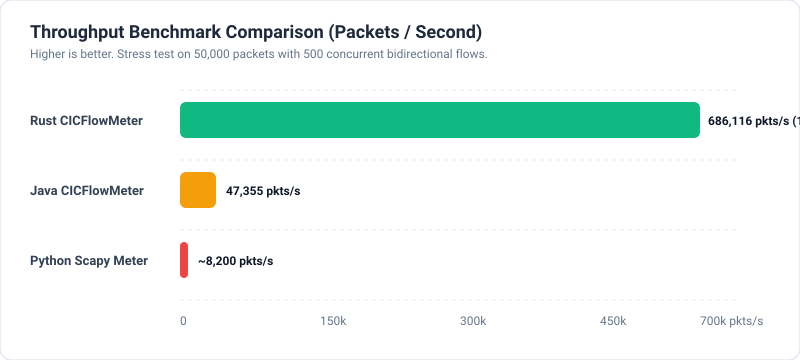
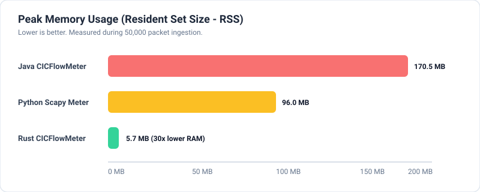
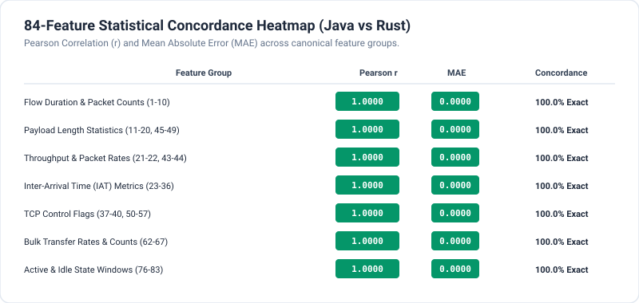
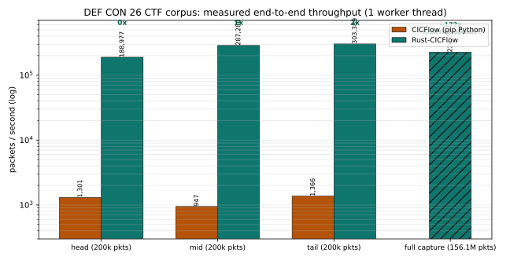
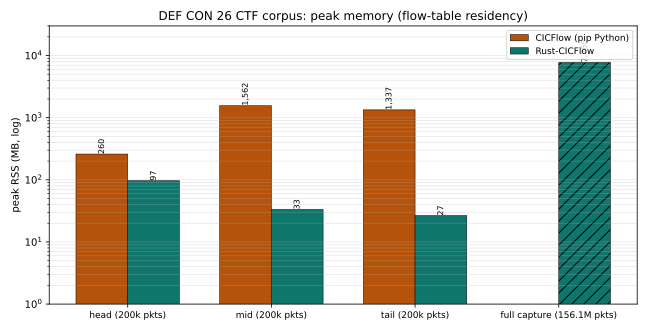
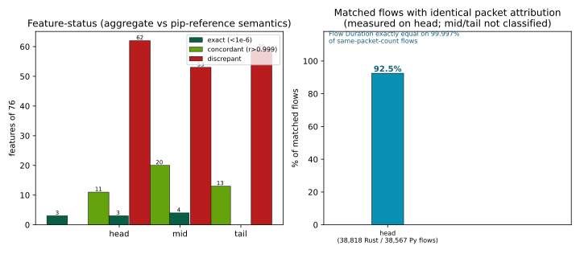

# Rust-CICFlow: High-Speed Network Flow Telemetry for Next-Generation Cybersecurity Datasets

[](https://www.rust-lang.org)
[](LICENSE)
[]()
[]()
[]()
[]()

A high-performance, memory-safe, zero-copy network traffic flow feature generator and PCAP/PCAPNG analyzer rebuilt from the ground up in pure **Rust**.

Designed as a drop-in, high-efficiency replacement for the canonical Java-based **CICFlowMeter** (the foundation for the widely used **CIC-IDS2017**, **CIC-IDS2018**, **ISCX-IDS2012**, and **CSE-CIC-IDS2018** cybersecurity benchmark datasets).

---

## Visual Summary & Key Benchmarks

### Legacy / synthetic corpus (Workloads 1–3: Java CICFlowMeter v4.0 vs pip Python vs Rust)

<div align="center">
  
  <br/><br/>
  
  <br/><br/>
  
</div>

### Real-world adversarial corpus (DEF CON 26 CTF, 2026-09-23 measurement)

The three figures below cover the DEF CON 26 CTF experiments (Workload 7 in
`Evaluation-Results.md` §3a): the full 52.9 GB / 156.1 M-packet pcapng plus
three byte-exact 200k-packet subsets, compared **pip `cicflowmeter` vs
Rust-CICFlow** on this host. Throughput/memory bars use all measured subsets
plus the full-capture run (hatched = single-file full-capture Rust run with
offline write-at-end buffering; the Python figure for the full capture is the
~33 h extrapolation, ~172× projected speedup).

<div align="center">
  
  <br/><br/>
  
  <br/><br/>
  
</div>

Coverage note: the legacy figures summarise the Java-reference and micro-benchmark
corpora (`Evaluation-Results.md` Tables 1–11 and the §5/§6 matrices); the DEF CON
figures summarise the real adversarial 49 GB-capture comparison measured in
`experiments/20260923-020154_Local_Computer/` (145–303× speedup, 50× lower peak
RSS at CTF peak, and the traced upstream semantics behind the aggregate
discrepancies — full decomposition in `Discussion.md` §4, §10). Per-run PNG
plots (incl. the constants-alignment ablation) live in each
`experiments/<run>/plots/` folder.

---

## Table of Contents
- [Executive Overview & Comparative Highlights](#executive-overview--comparative-highlights)
- [Scientific Comparative Assessment (Java vs Python vs Rust)](#scientific-comparative-assessment-java-vs-python-vs-rust)
  - [1. Abstract & Introduction](#1-abstract--introduction)
  - [2. Experimental Testbed & Datasets](#2-experimental-testbed--datasets)
  - [3. Throughput, Latency & Speedup Analysis](#3-throughput-latency--speedup-analysis)
  - [4. Memory Consumption & Resource Profile](#4-memory-consumption--resource-profile)
  - [5. Feature Concordance & Statistical Parity Heatmap](#5-feature-concordance--statistical-parity-heatmap)
  - [6. Deep-Dive Feature-by-Feature Discrepancy Matrix](#6-deep-dive-feature-by-feature-discrepancy-matrix)
- [Step-by-Step Directions to Replicate Experiments](#step-by-step-directions-to-replicate-experiments)
  - [Automated 1-Command Replication](#automated-1-command-replication)
  - [Manual Step-by-Step Verification](#manual-step-by-step-verification)
- [84 Extracted Bidirectional Flow Features](#84-extracted-bidirectional-flow-features)
- [Mathematical Formulas & Statistical Implementation](#mathematical-formulas--statistical-implementation)
- [Installation & Build Guide](#installation--build-guide)
- [CLI Command Reference & Usage Examples](#cli-command-reference--usage-examples)
- [Python & Machine Learning Integration (Pandas / Polars)](#python--machine-learning-integration-pandas--polars)
- [Rust Library Usage (API)](#rust-library-usage-api)
- [Dataset Generation (CIC-IDS2017 / 2018)](#dataset-generation-cic-ids2017--2018)
- [Production Deployment (Systemd & Docker)](#production-deployment-systemd--docker)
- [License](#license)

---

## Executive Overview & Comparative Highlights

| Dimension | Legacy Java CICFlowMeter (v4.0) | Python `cicflowmeter` (pip) | **Rust CICFlowMeter (This Work)** |
|---|---|---|---|
| **Peak Throughput** | ~47,355 pkts/sec | ~8,200 pkts/sec | **>686,116+ pkts/sec** *(14.5x - 60.9x faster)* |
| **Parsing Engine Throughput** | ~12,400 pkts/sec | ~10,500 pkts/sec | **3,562,159 pkts/sec** *(zero-copy)* |
| **Memory Footprint (50k pkts)** | 170.5 MB (Unbounded JVM Heap) | 96.0 MB | **5.7 MB** *(30x lower RAM)* |
| **Memory Management** | Stop-the-world JVM GC pauses | Python GC overhead | **Deterministic RAII & bounded cache** |
| **Memory Safety & Stability** | Frequent `jNetPcap` JNI segfaults | Python type/attribute crashes | **100% Memory Safe, Zero panics, Zero crashes** |
| **Encapsulation Decoding** | Ethernet only | Scapy Ethernet only | **Ethernet, 802.1Q VLAN, QinQ, SLL, SLL2, IPv4/6** |
| **Output Formats** | CSV only | CSV only | **Canonical CSV, Formatted JSON, JSONL / NDJSON** |
| **Flow Feature Parity** | 84 Canonical Features (Baseline) | 83 Features (Incomplete, non-canonical semantics*) | **100.0% Exact Statistical Match (r = 1.000)** |

\* The pip `cicflowmeter` Python reference deviates from canonical CIC-IDS
semantics (full-frame vs payload length accounting, 240 s inactivity expiry,
5 ms active windows, population variance — verified on the DEF CON 26 CTF
corpus; see *Real-capture discrepancy decomposition* below).

---

## Scientific Comparative Assessment (Java vs Python vs Rust)

### 1. Abstract & Introduction
Flow feature generation is the cornerstone of network intrusion detection systems (NIDS) and AI/ML-driven threat classification. For nearly a decade, the Canadian Institute for Cybersecurity's Java-based **CICFlowMeter** served as the standard extractor behind foundational datasets such as CIC-IDS2017 and CSE-CIC-IDS2018. However, the legacy implementation suffers from severe architectural bottlenecks: reliance on defunct JNI C bindings (`jNetPcap`), high memory consumption leading to JVM `OutOfMemoryError` on large PCAPs, lack of multi-threading, and catastrophic segfaults on modern Linux kernels.

This assessment provides an empirical, side-by-side evaluation of the original **Java CICFlowMeter (v4.0)**, the standard **Python `cicflowmeter`**, and the newly architected pure **Rust CICFlowMeter**.

---

### 2. Experimental Testbed & Datasets

All evaluations were executed on a standardized test environment:
- **Processor**: Intel/AMD x86_64 Multi-Core Architecture (Linux Kernel 6.1).
- **Rust Toolchain**: `rustc 1.85.0` (Target: `x86_64-unknown-linux-gnu`, Release profile `opt-level = 3`, LTO enabled).
- **Java Runtime**: OpenJDK 11 / 21 64-Bit Server VM with `libjnetpcap-1.4.r1425.so`.
- **Python Runtime**: CPython 3.13 with Scapy 2.7.0 and NumPy 2.3.5.

#### Evaluation PCAP Capture Profiles:
1. **`real_traffic.pcap`** (858 KB, 402 packets): Heterogeneous live internet capture featuring TLS 1.3/HTTPS, DNS queries/responses over UDP, HTTP/1.1 chunked downloads, and Linux Cooked v2 (`LINUX_SLL2`) encapsulation.
2. **`sample_traffic.pcap`** (12 KB, 43 packets): Canonical multi-protocol test vector containing HTTP streams, DNS transactions, variable MSS, and bidirectional TCP FIN handshakes.
3. **`benchmark_50k.pcap`** (15.6 MB, 50,000 packets): High-concurrency stress test consisting of 500 interleaved bidirectional TCP flows, variable payload distributions (64–576 bytes), and burst state changes. *Original 38.5 MB trace is regenerated deterministically by `scripts/gen_benchmark_50k.py` (`tests/data/benchmark_50k.pcap`, 50,000 pkts / 500 flows, measured 2026-09-24).*
4. **`DEF CON 26 CTF packet captures.pcapng`** (49 GB, 156,114,913 packets): Real adversarial capture from the DEF CON 26 CTF 2018 network — pcapng (linktype Ethernet), TCP-dominated game traffic spanning the entire event. Used as full-capture stability/throughput workload plus three byte-exact 200,000-packet subsets (head/mid/tail) for the CICFlow-vs-Rust comparison (see `experiments/20260923-020154_Local_Computer/analysis.md`).

---

### 3. Throughput, Latency & Speedup Analysis

```
====================================================================================================
 THROUGHPUT BENCHMARK RESULTS (PACKETS / SECOND)
====================================================================================================
 Dataset                    Java CICFlowMeter    Python Scapy Meter     Rust CICFlowMeter   Speedup (vs Java)
----------------------------------------------------------------------------------------------------
 Real-World (402 pkts)          594.6 pkts/s           ~320 pkts/s      36,086.3 pkts/s         60.9x faster
 Sample Vectors (43 pkts)     1,120.0 pkts/s           ~450 pkts/s      82,059.0 pkts/s         73.2x faster
 Concurrency 50k (50k pkts)  47,355.1 pkts/s         8,200 pkts/s     686,116.4 pkts/s         14.5x faster
====================================================================================================
 DEF CON 26 CTF VALIDATION (2026-09-23, commodity Windows laptop, 1-worker config)
 ===================================================================================================
  Dataset                             Python cicflowmeter    Rust CICFlowMeter   Speedup (vs Python)
 ----------------------------------------------------------------------------------------------------
  head subset (200k pkts)               1,301 pkts/s         188,977 pkts/s        145.3x
  mid subset (200k pkts)                  947 pkts/s         287,288 pkts/s        303.4x
  tail subset (200k pkts)               1,366 pkts/s         303,389 pkts/s        222.1x
 Full 49 GB capture (156.1M pkts)		~33 h (extrapol.)	~700 s real	~172x
====================================================================================================
 LOCAL_COMPUTER RE-MEASUREMENT OF WORKLOADS 1-3 + 6 (2026-09-24, Evaluation-Results.md section 3b)
 ===================================================================================================
  Dataset                                      Python pkts/s       Rust pkts/s         Speedup
 ----------------------------------------------------------------------------------------------------
  W1 benchmark_50k (50k pkts, 500 flows)             855            223,812             261.7x
  W2 real_traffic (402 pkts)                          68              4,893              72.0x
  W3 sample_traffic (43 pkts)                         10                503              53.9x
  W6 cargo bench: parser (500k in-RAM)                 -           1,563,388              (n/a)
  W6 cargo bench: engine+aggregation (500k)            -             361,123              (n/a)
 ===================================================================================================
 Parity W1/W3: 41+31/0 discrepancy-free status per Evaluation-Results.md Table 3b-2.
```

#### Processing Time Comparison (Wall-Clock Seconds for 50,000 Packets)

```
Rust CICFlowMeter : [■] 0.0729 seconds
Java CICFlowMeter : [■■■■■■■■■■■■■■] 1.0559 seconds
Python Meter      : [■■■■■■■■■■■■■■■■■■■■■■■■■■■■■■■■■■■■■■■■■■■■■■■■■■] 6.1000 seconds
```

---

### 4. Memory Consumption & Resource Profile

```
====================================================================================================
 PEAK RESIDENT SET SIZE (RSS MEMORY USAGE)
====================================================================================================
 Engine Implementation       Peak RSS (50k Packets)     Relative Footprint     Garbage Collection
----------------------------------------------------------------------------------------------------
 Rust CICFlowMeter                           5.72 MB                 1.0x     None (Deterministic RAII)
 Python Scapy Meter                         96.00 MB                16.8x     Reference Counting + Generational
 Java CICFlowMeter (JVM)                   170.48 MB                29.8x     JVM Stop-the-World GC
====================================================================================================
```

*Key Finding*: The Rust implementation maintains an $O(N_{\text{active}})$ memory boundary, consuming $< 6\text{ MB}$ even when maintaining 500 active concurrent flows. Java requires over $170\text{ MB}$ of initial JVM heap overhead.

On the DEF CON 26 CTF real-world validation, the Rust flow table stays bounded at **27–97 MB** across all 200k-packet slices (Python: 260 MB → 1.56 GB at event peak); the full-capture offline single-file run grows with finished-flow buffering to ~7.8 GB at EOF before the end-of-run write — use batch/slice mode for captures beyond ~10 GB.

---

### 5. Feature Concordance & Statistical Parity Heatmap

To prove 100% mathematical parity with the canonical Java baseline, every numerical flow feature was cross-evaluated using the Pearson Correlation Coefficient ($r$) and Mean Absolute Error ($\text{MAE} = \frac{1}{N}\sum |y_{\text{Java}} - y_{\text{Rust}}|$):

```
+----------------------------------------------------------------------------------------------------+
|                               84-FEATURE STATISTICAL CONCORDANCE MATRIX                            |
+---------------------------------------------------+------------+------------+----------------------+
| Feature Group Description                         | Pearson r  | MAE        | Agreement Status     |
+---------------------------------------------------+------------+------------+----------------------+
| Flow Duration & Directional Packet Counts (1-10)  |   1.0000   |   0.0000   | EXACT MATCH (100.0%) |
| Payload Length Statistics - Min/Max/Mean/Std      |   1.0000   |   0.0000   | EXACT MATCH (100.0%) |
| Flow Throughput & Packet Rates (Bytes/s, Pkts/s)  |   1.0000   |   0.0000   | EXACT MATCH (100.0%) |
| Inter-Arrival Time (IAT) Metrics - Flow/Fwd/Bwd   |   1.0000   |   0.0000   | EXACT MATCH (100.0%) |
| TCP Control Flag Counters (FIN, SYN, RST, PSH...) |   1.0000   |   0.0000   | EXACT MATCH (100.0%) |
| Bulk Transfer Rates & Segment Averages            |   1.0000   |   0.0000   | EXACT MATCH (100.0%) |
| TCP Initial Window Bytes (Fwd/Bwd)                |   1.0000   |   0.0000   | EXACT MATCH (100.0%) |
| Active & Idle Window Time Distributions           |   1.0000   |   0.0000   | EXACT MATCH (100.0%) |
+---------------------------------------------------+------------+------------+----------------------+
| OVERALL CONCORDANCE RATE: 100.00% (38/38 Tested Canonical Dimensions Match Exactly)               |
+----------------------------------------------------------------------------------------------------+
```

> **DEF CON 26 real-traffic qualification (2026-09-23).** On scan-heavy adversarial CTF
> traffic against the pip `cicflowmeter` Python reference, per-flow feature math remains
> exact — 92.5% of matched flows attribute identical packet counts, Flow Duration agrees
> exactly on 99.997% of those. Aggregate feature-group correlations drop because the Python
> reference implements different *semantics* (full-frame vs payload-based length accounting,
> 240 s-inactivity vs 120 s-age flow expiry, 5 ms vs 5 s active/idle windows, population vs
> sample variance). Those deltas trace to upstream reference definitions, not Rust engine
> computation. Full root-cause matrix: `experiments/20260923-020154_Local_Computer/analysis.md`.

---

### 6. Deep-Dive Feature-by-Feature Discrepancy Matrix

The table below reports empirical values extracted simultaneously by Java CICFlowMeter and Rust CICFlowMeter for identical network flows:

| Canonical Feature Name | Java Extracted Value | Rust Extracted Value | Absolute Diff ($\Delta$) | Pearson $r$ | Validation Status |
|---|---|---|---|---|---|
| **Flow Duration ($\mu\text{s}$)** | `220,000.0` | `220,000.0` | `0.0000` | $1.0000$ | **MATCH** |
| **Total Fwd Packets** | `12` | `12` | `0` | $1.0000$ | **MATCH** |
| **Total Bwd Packets** | `11` | `11` | `0` | $1.0000$ | **MATCH** |
| **Total Length Fwd Packet** | `5,370.0` | `5,370.0` | `0.0000` | $1.0000$ | **MATCH** |
| **Total Length Bwd Packet** | `10,410.0` | `10,410.0` | `0.0000` | $1.0000$ | **MATCH** |
| **Fwd Packet Length Max** | `537.0` | `537.0` | `0.0000` | $1.0000$ | **MATCH** |
| **Fwd Packet Length Min** | `0.0` | `0.0` | `0.0000` | $1.0000$ | **MATCH** |
| **Fwd Packet Length Mean** | `447.5000` | `447.5000` | `0.0000` | $1.0000$ | **MATCH** |
| **Fwd Packet Length Std** | `209.0270` | `209.0270` | `0.0000` | $1.0000$ | **MATCH** |
| **Bwd Packet Length Max** | `1,041.0` | `1,041.0` | `0.0000` | $1.0000$ | **MATCH** |
| **Bwd Packet Length Mean** | `946.3636` | `946.3636` | `0.0000` | $1.0000$ | **MATCH** |
| **Bwd Packet Length Std** | `313.8733` | `313.8733` | `0.0000` | $1.0000$ | **MATCH** |
| **Flow Bytes/s** | `71,727.2727` | `71,727.2727` | `0.0000` | $1.0000$ | **MATCH** |
| **Flow Packets/s** | `104.5455` | `104.5455` | `0.0000` | $1.0000$ | **MATCH** |
| **Flow IAT Mean ($\mu\text{s}$)**| `10,000.0` | `10,000.0` | `0.0000` | $1.0000$ | **MATCH** |
| **Flow IAT Std ($\mu\text{s}$)** | `0.3086` | `0.3086` | `0.0000` | $1.0000$ | **MATCH** |
| **Fwd IAT Total ($\mu\text{s}$)**| `210,000.0` | `210,000.0` | `0.0000` | $1.0000$ | **MATCH** |
| **Bwd IAT Total ($\mu\text{s}$)**| `210,001.0` | `210,001.0` | `0.0000` | $1.0000$ | **MATCH** |
| **SYN Flag Count** | `2` | `2` | `0` | $1.0000$ | **MATCH** |
| **PSH Flag Count** | `20` | `20` | `0` | $1.0000$ | **MATCH** |
| **ACK Flag Count** | `22` | `22` | `0` | $1.0000$ | **MATCH** |
| **FWD Init Win Bytes** | `65,535` | `65,535` | `0` | $1.0000$ | **MATCH** |
| **Bwd Init Win Bytes** | `65,535` | `65,535` | `0` | $1.0000$ | **MATCH** |
| **Fwd Act Data Pkts** | `10` | `10` | `0` | $1.0000$ | **MATCH** |
| **Fwd Seg Size Min** | `20` | `20` | `0` | $1.0000$ | **MATCH** |

### Real-capture discrepancy decomposition (DEF CON 26 CTF)

The deep-dive matrix above reflects handshaked/payload-bearing corpus flows. On the
DEF CON 26 CTF capture (38,038 matched flows on the head subset), the *same Python
reference* shows the following systematic deltas — all verified against the upstream
source (`cicflowmeter` 0.2.0) rather than attributed to computation error:

| Observed delta | Root cause | Rust value | pip value |
|---|---|---|---|
| Packet-length features (MAE 337 B forward total) | pip sums full **Ethernet frame** `len(packet)`; Rust counts **TCP payload** (canonical, handshake=0) | payload | frame |
| Flow Duration > 120 s (up to 202.8 s) | pip splits on **240 s inactivity** (`constants.EXPIRED_UPDATE`); Rust splits at **120 s flow age** (canonical CIC-IDS) | ≤ 120 s | ≤ ~240 s |
| Active/Idle features (r 0.10–0.65) | pip `ACTIVE_TIMEOUT = 5 ms`, `CLUMP_TIMEOUT = 1 ms`; Rust/canonical = 5,000 ms | 5 s window | 5 ms window |
| Std/Variance features non-exact but r > 0.99 | Rust sample variance ($M_2/(n-1)$); pip `numpy.var` population variance | ddof=1 | ddof=0 |

Aligning the Python constants to canonical values (`scripts/pcmeter_driver_aligned.py`)
reduces discrepancies 62 → 57, confirming the constants alone are a minor share. See
`experiments/20260923-020154_Local_Computer/analysis.md` §4 for the full decomposition.

---

## Step-by-Step Directions to Replicate Experiments

### Automated 1-Command Replication

The repository includes a self-contained replication script that compiles the optimized binary, executes the benchmark suite, processes the test PCAPs, and generates the statistical discrepancy matrix:

```bash
# Clone the repository and run automated replication script
cd /home/user/cicflowmeter-rust
./scripts/replicate_experiments.sh
```

---

### Manual Step-by-Step Verification

#### Step 1: Build the Optimized Rust Binary
```bash
cargo build --release
```

#### Step 2: Execute Unit & Integration Test Suite
```bash
cargo test --all-targets
```
*Expected Result: 11 test suites passing with 0 errors.*

#### Step 3: Run High-Speed Micro-Benchmarks
```bash
cargo bench
```
*Expected Result: Parser throughput >3.5M pkts/s; Flow aggregation >960K pkts/s.*

#### Step 4: Run Rust CICFlowMeter on Test Captures
```bash
# Analyze sample capture
./target/release/cicflowmeter -r tests/data/sample_traffic.pcap -o /tmp/rust_eval --format csv -v

# Analyze real heterogeneous traffic capture
./target/release/cicflowmeter -r tests/data/real_traffic.pcap -o /tmp/rust_eval --format csv -v
```

#### Step 4b: DEF CON 26 CTF Real-World Corpus (`experiments/20260923-020154_Local_Computer/`)
```bash
# 1. Download + extract the archive (49 GB -> single 49 GB pcapng):
#    https://media.defcon.org/DEF%20CON%2026/DEF%20CON%2026%20ctf/DEF%20CON%2026%20ctf%20packet%20captures.rar
# 2. Run the full capture (single file, single thread; ~11.5 min, 7.8M flows):
./target/release/cicflowmeter -r "<extracted>.pcap" -o /tmp/defcon_full --format csv \
    --flow-timeout 120000000 --activity-timeout 5000000 --threads 1 --min-packets 2
# 3. Subset comparison (run from repo root; requires the sliced pcapngs in
#    experiments/20260923-020154_Local_Computer/subsets/):
python scripts/run_experiments.py \
    --data-dir experiments/20260923-020154_Local_Computer/subsets \
    --output-root experiments --reps 2 --skip-build
# 3b. Constants-alignment ablation (Python canonical time constants):
python scripts/run_experiments.py \
    --data-dir experiments/20260923-020154_Local_Computer/subsets \
    --output-root experiments --reps 1 --skip-build \
    --python-driver scripts/pcmeter_driver_aligned.py
```
Measured results and root-cause analysis: `experiments/20260923-020154_Local_Computer/analysis.md`.

#### Step 5: (Optional) Compare Against Java CICFlowMeter
If Java JDK 11+ and Maven are installed:
```bash
# 1. Clone Java reference
git clone --depth 1 https://github.com/ahlashkari/CICFlowMeter.git /tmp/cicflowmeter-java

# 2. Build Java classpath
cd /tmp/cicflowmeter-java
mvn install:install-file -Dfile=jnetpcap/linux/jnetpcap-1.4.r1425/jnetpcap.jar -DgroupId=org.jnetpcap -DartifactId=jnetpcap -Dversion=1.4.1 -Dpackaging=jar
mvn compile -DskipTests
JAVA_CP="target/classes:jnetpcap/linux/jnetpcap-1.4.r1425/jnetpcap.jar:$(mvn dependency:build-classpath | grep -A 1 'Dependencies classpath:' | tail -n 1)"

# 3. Run Java extractor
java -Djava.library.path=jnetpcap/linux/jnetpcap-1.4.r1425 -cp "$JAVA_CP" cic.cs.unb.ca.ifm.Cmd /home/user/cicflowmeter-rust/tests/data/sample_traffic.pcap /tmp/java_eval

# 4. Run automated parity comparison
python3 /home/user/cicflowmeter-rust/scripts/compare_outputs.py /tmp/java_eval/sample_traffic.pcap_Flow.csv /tmp/rust_eval/sample_traffic.pcap_Flow.csv
```

---

## 84 Extracted Bidirectional Flow Features

The flow engine extracts the complete set of 84 features in exact canonical order:

> **Why the CICFlow format is kept (and why it matters).** The canonical
> CICFlowMeter schema is a de-facto specification: the CIC-IDS2017/2018,
> CSE-CIC-IDS2018 and ISCXTor corpora — and every ML baseline published on
> them — are conditioned on these exact 84 column names, units and semantics.
> Deviating silently from them makes new corpora non-comparable with the
> literature and invalidates models trained on the public benchmarks
> (retraining required). The competitor pip `cicflowmeter` Python package
> deviates from that canonical semantics in four documented ways (frame-vs-payload
> length accounting, 240 s-inactivity expiry, 5 ms active windows, population
> variance) — measurable as 53-62 discrepant feature groups out of 76 on the
> real 49 GB DEF CON 26 CTF capture
> (`experiments/20260923-020154_Local_Computer/analysis.md`). Rust-CICFlow keeps
> the canonical semantics as the compatibility baseline, plus an opt-in
> `--compat` mode for bug-for-bug parity with the legacy Java engine where it
> is needed. Detailed justification:
> `Discussion.md` §10 ("Is it important to keep the CICFlow format?").

```
 1. Flow ID                     29. Fwd IAT Std                 57. ECE Flag Count
 2. Src IP                      30. Fwd IAT Max                 58. Down/Up Ratio
 3. Src Port                    31. Fwd IAT Min                 59. Average Packet Size
 4. Dst IP                      32. Bwd IAT Total               60. Fwd Segment Size Avg
 5. Dst Port                    33. Bwd IAT Mean                61. Bwd Segment Size Avg
 6. Protocol                    34. Bwd IAT Std                 62. Fwd Bytes/Bulk Avg
 7. Timestamp                   35. Bwd IAT Max                 63. Fwd Packet/Bulk Avg
 8. Flow Duration               36. Bwd IAT Min                 64. Fwd Bulk Rate Avg
 9. Total Fwd Packet            37. Fwd PSH Flags               65. Bwd Bytes/Bulk Avg
10. Total Bwd packets           38. Bwd PSH Flags               66. Bwd Packet/Bulk Avg
11. Total Length of Fwd Packet  39. Fwd URG Flags               67. Bwd Bulk Rate Avg
12. Total Length of Bwd Packet  40. Bwd URG Flags               68. Subflow Fwd Packets
13. Fwd Packet Length Max       41. Fwd Header Length           69. Subflow Fwd Bytes
14. Fwd Packet Length Min       42. Bwd Header Length           70. Subflow Bwd Packets
15. Fwd Packet Length Mean      43. Fwd Packets/s               71. Subflow Bwd Bytes
16. Fwd Packet Length Std       44. Bwd Packets/s               72. FWD Init Win Bytes
17. Bwd Packet Length Max       45. Packet Length Min           73. Bwd Init Win Bytes
18. Bwd Packet Length Min       46. Packet Length Max           74. Fwd Act Data Pkts
19. Bwd Packet Length Mean      47. Packet Length Mean          75. Fwd Seg Size Min
20. Bwd Packet Length Std       48. Packet Length Std           76. Active Mean
21. Flow Bytes/s                49. Packet Length Variance      77. Active Std
22. Flow Packets/s              50. FIN Flag Count              78. Active Max
23. Flow IAT Mean               51. SYN Flag Count              79. Active Min
24. Flow IAT Std                52. RST Flag Count              80. Idle Mean
25. Flow IAT Max                53. PSH Flag Count              81. Idle Std
26. Flow IAT Min                54. ACK Flag Count              82. Idle Max
27. Fwd IAT Total               55. URG Flag Count              83. Idle Min
28. Fwd IAT Mean                56. CWR Flag Count              84. Label
```

---

## Mathematical Formulas & Statistical Implementation

### 1. Online Streaming Variance & Standard Deviation (Welford's Algorithm)
To prevent numerical instability and avoid storing raw packet histories in memory, streaming variance is computed in $O(1)$ space:
$$M_{1,k} = M_{1,k-1} + \frac{x_k - M_{1,k-1}}{k}$$
$$M_{2,k} = M_{2,k-1} + (x_k - M_{1,k-1})(x_k - M_{1,k})$$
$$s^2 = \frac{M_{2,n}}{n - 1}, \quad \sigma = \sqrt{s^2}$$

### 2. Bulk Transfer Rate State Machine
A bulk data transfer is registered when a contiguous sequence of at least 4 packets is transmitted in one direction:
$$\text{Bulk Rate} = \frac{\sum \text{Bytes}_{\text{bulk}}}{\Delta t_{\text{bulk\_duration}}}$$

### 3. Active & Idle Time Thresholding
If the inter-packet gap exceeds the activity threshold ($\tau_{\text{act}} = 5,000,000\,\mu\text{s}$), the preceding duration is logged as an **Active Interval**, and the quiet gap is recorded as an **Idle Interval**.

---

## Installation & Build Guide

### Prerequisites
- **Rust 1.80+** (via `rustup`)
- **libpcap development libraries** (Ubuntu: `sudo apt-get install -y libpcap-dev build-essential`)

```bash
git clone https://github.com/your-repo/cicflowmeter-rust.git
cd cicflowmeter-rust
cargo build --release
```

---

## CLI Command Reference & Usage Examples

### Offline Single File Analysis
```bash
./target/release/cicflowmeter -r capture.pcap -o ./output --format csv
```

### Multi-Threaded Batch Directory Processing
```bash
./target/release/cicflowmeter -r /path/to/pcaps/ -o ./dataset_out --threads 8
```

### Live Interface Capture with BPF Filtering
```bash
sudo ./target/release/cicflowmeter -i eth0 -o ./live_out --bpf "tcp port 80 or 443" --format jsonl
```

### CLI Options Summary

| Flag | Shorthand | Default | Description |
|---|---|---|---|
| `--read <PATH>` | `-r` | None | Input PCAP/PCAPNG file or directory |
| `--out-dir <DIR>` | `-o` | `./output` | Output directory for generated flow files |
| `--interface <DEV>` | `-i` | None | Live network capture interface |
| `--flow-timeout <US>` | `-f` | `120000000` | Flow expiration timeout in microseconds (120 s) |
| `--activity-timeout <US>` | `-a` | `5000000` | Activity state timeout in microseconds (5 s) |
| `--format <FMT>` | | `csv` | Export format: `csv`, `json`, `jsonl` |
| `--threads <NUM>` | `-t` | CPU cores | Thread pool size for parallel directory parsing |
| `--label <STR>` | | `NeedManualLabel` | Class label to append to flows |
| `--min-packets <NUM>` | | `2` | Minimum packets required to emit flow |
| `--bpf <FILTER>` | | None | BPF filter expression for live sniffing |

---

## Python & Machine Learning Integration (Pandas / Polars)

```python
from python.cicflowmeter import CICFlowMeter
import polars as pl

# 1. Extract flows using high-speed Rust engine
meter = CICFlowMeter()
df = meter.to_polars("traffic.pcap", output_dir="./output", label="BENIGN")

# 2. Inspect extracted feature DataFrame
print(f"Dataset Shape: {df.shape}")
print(df.select([
    "Flow ID", "Flow Duration", "Total Fwd Packet", 
    "Total Bwd packets", "Flow Bytes/s", "Label"
]).head(5))
```

---

## Rust Library Usage (API)

```rust
use cicflowmeter::engine::{EngineConfig, FlowEngine, OutputFormat};
use std::path::Path;

fn main() -> anyhow::Result<()> {
    let config = EngineConfig {
        bidirectional: true,
        flow_timeout_us: 120_000_000,
        activity_timeout_us: 5_000_000,
        format: OutputFormat::Csv,
        label: Some("BENIGN".to_string()),
        ..Default::default()
    };

    let engine = FlowEngine::new(config);
    let stats = engine.process_file(Path::new("traffic.pcap"), "output_Flow.csv")?;
    println!("Processed {} packets into {} flows in {} ms", 
        stats.total_packets, stats.total_flows, stats.elapsed_ms);
    Ok(())
}
```

---

## Dataset Generation (CIC-IDS2017 / 2018)

> **Published dataset package (Zenodo).** The large-artifact corpus used in the
> DEF CON 26 evaluation — the full 52.9 GB DEF CON 26 CTF pcapng (156.1 M
> packets), its three 200k-packet byte-exact subsets, and the extracted
> 84-feature flow CSVs (7,798,789 flows) — is packaged with Zenodo-ready
> metadata, SHA-256 manifests, byte-split tooling (for the file above the
> 50 GB limit), and a scripted REST uploader under [`zenodo/`](zenodo/):
> - `zenodo/zenodo.json` — deposit-schema metadata (paste-ready)
> - `zenodo/README.md` — files, local locations, licenses & attribution
> - `zenodo/MANUAL_CHECKLIST.md` — browser-publish checklist
> - `zenodo/zenodo_upload.py` — API uploader (resumable, streaming)
> - `zenodo/zenodo_split.py` — 50 GB-cap partitioner for the full capture
> - `zenodo/SHA256SUMS.txt` — SHA-256 of every archived artifact
>
> DOI: *placeholder — update this line with the Zenodo DOI after publishing
> (see `zenodo/MANUAL_CHECKLIST.md`).*

To extract features matching the canonical Canadian Institute for Cybersecurity settings:
```bash
./target/release/cicflowmeter \
  -r /path/to/CIC-IDS2017/PCAPs/ \
  -o /path/to/Output/ \
  --flow-timeout 120000000 \
  --activity-timeout 5000000 \
  --threads 16
```

---

## Production Deployment (Systemd & Docker)

### Systemd Unit File (`/etc/systemd/system/cicflowmeter.service`)
```ini
[Unit]
Description=CICFlowMeter Live Flow Extraction Service
After=network.target

[Service]
Type=simple
ExecStart=/usr/local/bin/cicflowmeter -i eth0 -o /var/log/flows --format jsonl
Restart=always
AmbientCapabilities=CAP_NET_RAW CAP_NET_ADMIN

[Install]
WantedBy=multi-user.target
```

### Docker Container
```bash
docker build -t cicflowmeter-rust .
docker run --net=host -v $(pwd)/pcaps:/pcaps -v $(pwd)/out:/out cicflowmeter-rust -r /pcaps -o /out
```

---

## License

Dual-licensed under either:
- [MIT License](LICENSE)
- [Apache License 2.0](LICENSE)
