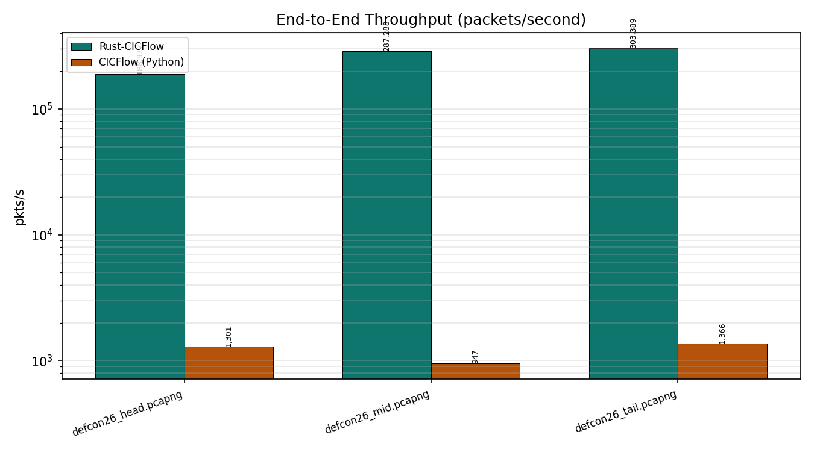
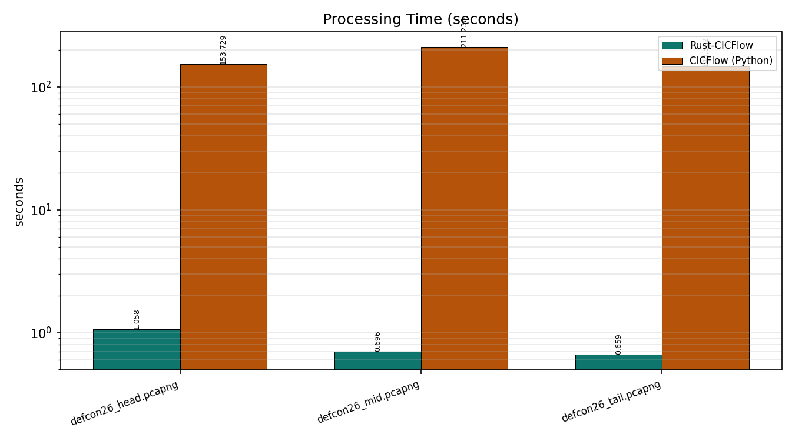
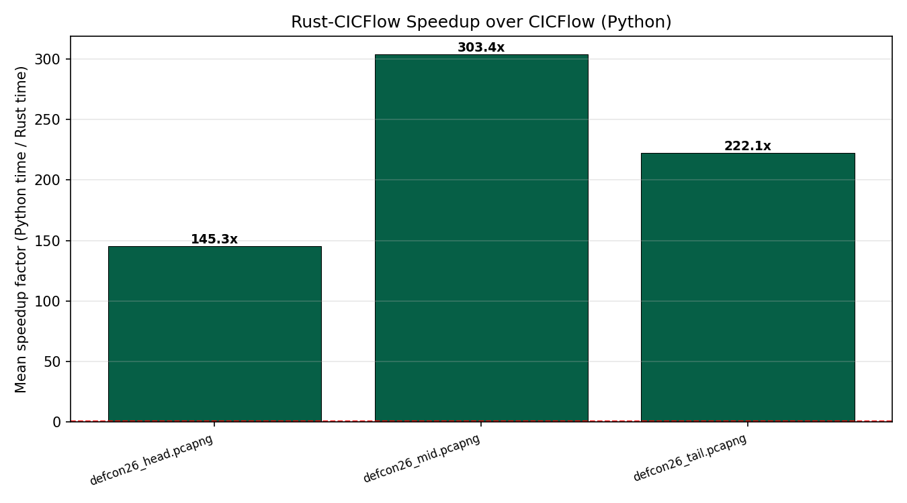
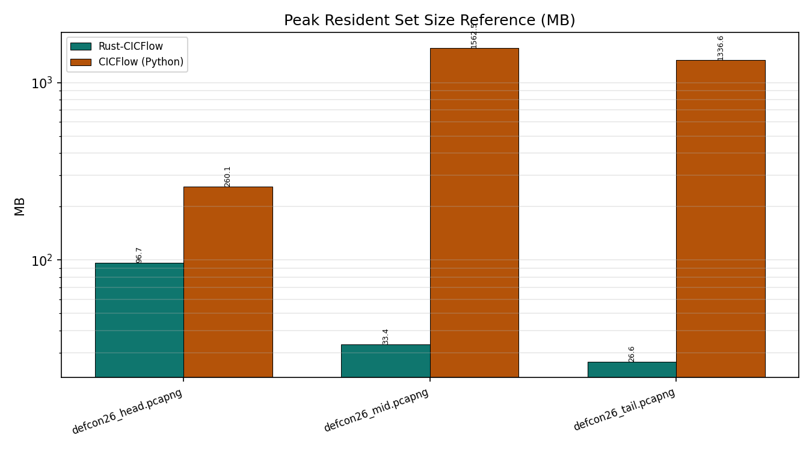
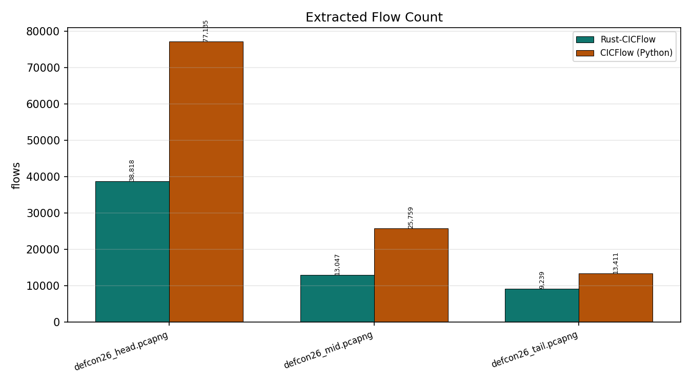
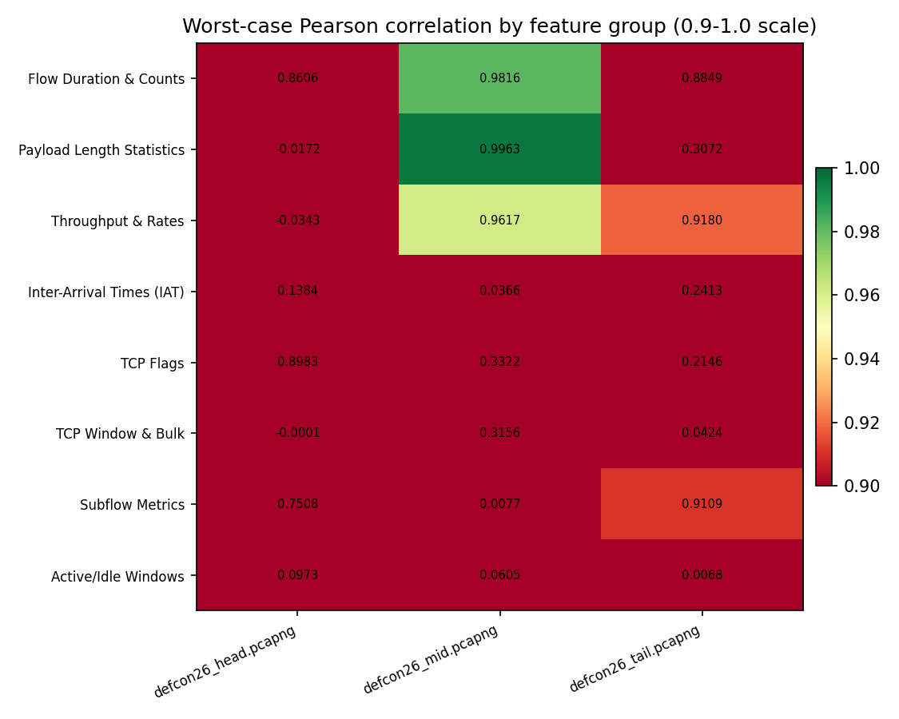
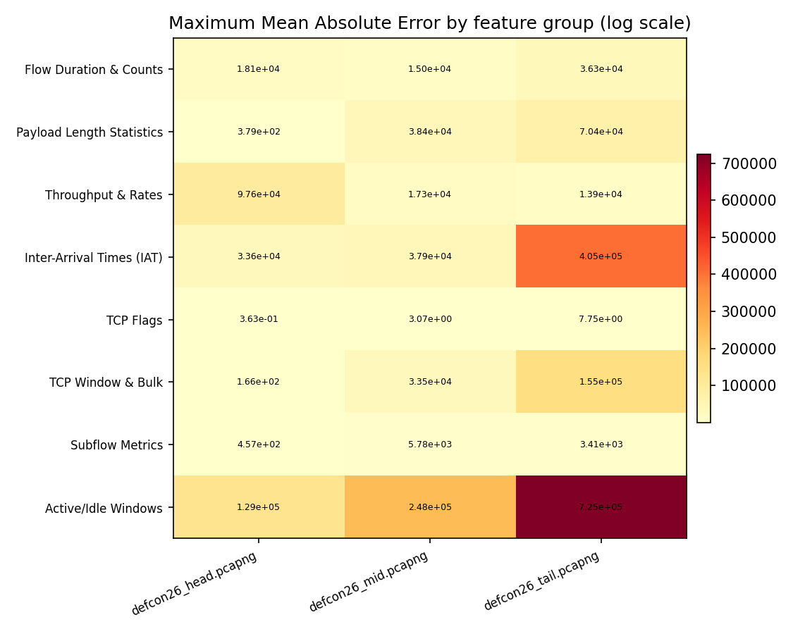

# CICFlow vs Rust-CICFlow — Experimental Comparison Report

**Platform:** `Zephyrus G14, Ryzen 7 6800HS, 40.960MB RAM`  
**Date/Time:** 2026-09-23 02:01:55  
**System:** Windows 10 (AMD64) — AMD64 Family 25 Model 68 Stepping 1, AuthenticAMD  
**Python:** 3.11.9  ·  **Rust:** cargo 1.98.0 (797e8a9bc 2026-08-05)  
**CICFlow (Python) package:** 0.2.0  
**Flags:** reps=2, threads=1, flow-timeout=120000000, activity-timeout=5000000, min-packets-per-flow=2, compat=False

---

## 1. Datasets

| Dataset | Size | Packets | Rust flows | Python flows |
|---|---|---|---|---|
| defcon26_head.pcapng | 27.0 MB | 200000 | 38818 | 77135 |
| defcon26_mid.pcapng | 106.3 MB | 200000 | 13047 | 25759 |
| defcon26_tail.pcapng | 50.4 MB | 200000 | 9239 | 13411 |

---

## 2. Throughput & Processing Time

| Dataset | Packets | Rust time (s) | Python time (s) | Rust (pkts/s) | Python (pkts/s) | Speedup |
|---|---|---|---|---|---|---|
| defcon26_head.pcapng | 200000 | 1.0583 | 153.7290 | 188,977 | 1,301 | 145.3x |
| defcon26_mid.pcapng | 200000 | 0.6962 | 211.2298 | 287,288 | 947 | 303.4x |
| defcon26_tail.pcapng | 200000 | 0.6592 | 146.3915 | 303,389 | 1,366 | 222.1x |

### Throughput comparison

### Processing time comparison

### Speedup

---

## 3. Memory

| Dataset | Rust peak RSS (MB) | Python peak RSS (MB) | Ratio (Python/Rust) |
|---|---|---|---|
| defcon26_head.pcapng | 96.69 | 260.14 | 2.7x |
| defcon26_mid.pcapng | 33.40 | 1562.51 | 46.8x |
| defcon26_tail.pcapng | 26.64 | 1336.61 | 50.2x |

### Memory comparison

---

## 4. Flow Extraction

---

## 5. Feature Concordance (Rust vs Python)

| Dataset | Rust flows | Python flows | Matched | Features | Exact | Concordant | Discrepant | Mean r | Mean MAE |
|---|---|---|---|---|---|---|---|---|---|
| defcon26_head.pcapng | 38818 | 38567 | 38038 | 76 | 3 | 11 | 62 | 0.7373 | 12373.1414 |
| defcon26_mid.pcapng | 13047 | 12879 | 12719 | 76 | 3 | 20 | 53 | 0.7775 | 16483.1497 |
| defcon26_tail.pcapng | 9239 | 6705 | 6695 | 76 | 4 | 13 | 59 | 0.7898 | 71473.7249 |

### Pearson correlation heatmap (by feature group)

### MAE heatmap (by feature group)

---

### Feature-by-feature concordance — `defcon26_head.pcapng`

| Feature | Group | Flows | MAE | Max diff | Pearson r | Status |
|---|---|---|---|---|---|---|
| Flow Duration | Flow Duration & Counts | n=38038 | 1.8059e+04 | 2.0280e+08 | 0.8606 | DISCREPANCY |
| Total Fwd Packet | Flow Duration & Counts | n=38038 | 7.4610e-02 | 1.6000e+01 | 0.9984 | DISCREPANCY |
| Total Bwd packets | Flow Duration & Counts | n=38038 | 1.1725e-02 | 1.9000e+01 | 0.9912 | DISCREPANCY |
| Total Length of Fwd Packet | Payload Length Statistics | n=38038 | 3.3690e+02 | 1.0898e+04 | 0.9985 | DISCREPANCY |
| Total Length of Bwd Packet | Payload Length Statistics | n=38038 | 1.1893e+01 | 1.2922e+04 | 0.9599 | DISCREPANCY |
| Fwd Packet Length Max | Payload Length Statistics | n=38038 | 7.3063e+01 | 9.1900e+02 | 0.9988 | DISCREPANCY |
| Fwd Packet Length Min | Payload Length Statistics | n=38038 | 6.4256e+01 | 1.3030e+03 | -0.0172 | DISCREPANCY |
| Fwd Packet Length Mean | Payload Length Statistics | n=38038 | 6.7350e+01 | 1.2040e+03 | 0.9597 | DISCREPANCY |
| Fwd Packet Length Std | Payload Length Statistics | n=38038 | 3.8869e+00 | 1.7587e+02 | 0.9982 | DISCREPANCY |
| Bwd Packet Length Max | Payload Length Statistics | n=38038 | 1.6000e+00 | 1.6990e+03 | 0.9967 | DISCREPANCY |
| Bwd Packet Length Min | Payload Length Statistics | n=38038 | 1.4518e+00 | 7.4000e+01 | 1.0000 | CONCORDANT |
| Bwd Packet Length Mean | Payload Length Statistics | n=38038 | 1.3265e+00 | 8.6147e+02 | 0.9753 | DISCREPANCY |
| Bwd Packet Length Std | Payload Length Statistics | n=38038 | 9.1050e-01 | 6.5871e+02 | 0.9949 | DISCREPANCY |
| Flow Bytes/s | Throughput & Rates | n=38038 | 9.7607e+04 | 2.8363e+05 | -0.0343 | DISCREPANCY |
| Flow Packets/s | Throughput & Rates | n=38038 | 5.3731e+00 | 7.3234e+02 | 0.9996 | CONCORDANT |
| Flow IAT Mean | Inter-Arrival Times (IAT) | n=38038 | 6.8905e+03 | 4.0560e+07 | 0.6182 | DISCREPANCY |
| Flow IAT Std | Inter-Arrival Times (IAT) | n=38038 | 1.3478e+04 | 8.1118e+07 | 0.6656 | DISCREPANCY |
| Flow IAT Max | Inter-Arrival Times (IAT) | n=38038 | 1.5648e+04 | 2.0280e+08 | 0.7206 | DISCREPANCY |
| Flow IAT Min | Inter-Arrival Times (IAT) | n=38038 | 7.1189e+02 | 1.0496e+07 | 0.1384 | DISCREPANCY |
| Fwd IAT Total | Inter-Arrival Times (IAT) | n=38038 | 2.6878e+04 | 2.0280e+08 | 0.8329 | DISCREPANCY |
| Fwd IAT Mean | Inter-Arrival Times (IAT) | n=38038 | 9.5617e+03 | 4.0560e+07 | 0.8089 | DISCREPANCY |
| Fwd IAT Std | Inter-Arrival Times (IAT) | n=38038 | 2.2065e+04 | 8.1118e+07 | 0.7109 | DISCREPANCY |
| Fwd IAT Max | Inter-Arrival Times (IAT) | n=38038 | 2.1290e+04 | 2.0280e+08 | 0.7005 | DISCREPANCY |
| Fwd IAT Min | Inter-Arrival Times (IAT) | n=38038 | 1.1150e+03 | 1.0495e+07 | 0.2746 | DISCREPANCY |
| Bwd IAT Total | Inter-Arrival Times (IAT) | n=38038 | 2.4054e+04 | 8.8623e+07 | 0.9159 | DISCREPANCY |
| Bwd IAT Mean | Inter-Arrival Times (IAT) | n=38038 | 2.6614e+04 | 2.0217e+07 | 0.8662 | DISCREPANCY |
| Bwd IAT Std | Inter-Arrival Times (IAT) | n=38038 | 2.3572e+04 | 1.7785e+07 | 0.8133 | DISCREPANCY |
| Bwd IAT Max | Inter-Arrival Times (IAT) | n=38038 | 1.4175e+04 | 4.3008e+07 | 0.9471 | DISCREPANCY |
| Bwd IAT Min | Inter-Arrival Times (IAT) | n=38038 | 3.3595e+04 | 2.0220e+07 | 0.3623 | DISCREPANCY |
| Fwd PSH Flags | TCP Flags | n=38038 | 3.6261e-01 | 8.6000e+01 | 1.0000 | CONCORDANT |
| Bwd PSH Flags | TCP Flags | n=38038 | 4.7505e-02 | 1.3000e+01 | 1.0000 | CONCORDANT |
| Fwd URG Flags | TCP Flags | n=38038 | 0.0000e+00 | 0.0000e+00 | 1.0000 | EXACT |
| Bwd URG Flags | TCP Flags | n=38038 | 0.0000e+00 | 0.0000e+00 | 1.0000 | EXACT |
| Fwd Header Length | Payload Length Statistics | n=38038 | 6.3939e+01 | 1.9880e+03 | 0.9967 | DISCREPANCY |
| Bwd Header Length | Payload Length Statistics | n=38038 | 1.6411e+00 | 8.0400e+02 | 0.9798 | DISCREPANCY |
| Fwd Packets/s | Flow Duration & Counts | n=38038 | 5.3701e+00 | 7.3234e+02 | 0.9996 | CONCORDANT |
| Bwd Packets/s | Flow Duration & Counts | n=38038 | 8.1599e-03 | 1.4242e+02 | 0.9928 | DISCREPANCY |
| Packet Length Min | Payload Length Statistics | n=38038 | 6.4246e+01 | 1.3030e+03 | -0.0172 | DISCREPANCY |
| Packet Length Max | Payload Length Statistics | n=38038 | 7.2968e+01 | 8.9100e+02 | 0.9996 | CONCORDANT |
| Packet Length Mean | Payload Length Statistics | n=38038 | 6.7214e+01 | 6.4468e+02 | 0.9885 | DISCREPANCY |
| Packet Length Std | Payload Length Statistics | n=38038 | 4.2211e+00 | 6.5702e+02 | 0.9956 | DISCREPANCY |
| Packet Length Variance | Payload Length Statistics | n=38038 | 3.7920e+02 | 4.3168e+05 | 0.9936 | DISCREPANCY |
| FIN Flag Count | TCP Flags | n=38038 | 1.7088e-03 | 3.0000e+00 | 0.9894 | DISCREPANCY |
| SYN Flag Count | TCP Flags | n=38038 | 3.4176e-04 | 3.0000e+00 | 0.9931 | DISCREPANCY |
| RST Flag Count | TCP Flags | n=38038 | 6.4961e-02 | 1.0000e+01 | 0.8983 | DISCREPANCY |
| PSH Flag Count | TCP Flags | n=38038 | 1.1042e-03 | 1.8000e+01 | 0.9995 | CONCORDANT |
| ACK Flag Count | TCP Flags | n=38038 | 2.1479e-02 | 3.5000e+01 | 0.9989 | DISCREPANCY |
| URG Flag Count | TCP Flags | n=38038 | 0.0000e+00 | 0.0000e+00 | 1.0000 | EXACT |
| CWR Flag Count | TCP Flags | n=38038 | 3.0759e-03 | 3.0000e+00 | 1.0000 | CONCORDANT |
| ECE Flag Count | TCP Flags | n=38038 | 5.2579e-05 | 2.0000e+00 | 0.9964 | DISCREPANCY |
| Down/Up Ratio | TCP Flags | n=38038 | 2.7703e-03 | 3.7500e+00 | 0.9620 | DISCREPANCY |
| Average Packet Size | Payload Length Statistics | n=38038 | 6.7214e+01 | 6.4468e+02 | 0.9885 | DISCREPANCY |
| Fwd Segment Size Avg | Throughput & Rates | n=38038 | 6.7350e+01 | 1.2040e+03 | 0.9597 | DISCREPANCY |
| Bwd Segment Size Avg | Throughput & Rates | n=38038 | 1.3265e+00 | 8.6147e+02 | 0.9753 | DISCREPANCY |
| Fwd Bytes/Bulk Avg | TCP Window & Bulk | n=38038 | 3.1666e+01 | 2.3078e+04 | 0.1443 | DISCREPANCY |
| Fwd Packet/Bulk Avg | TCP Window & Bulk | n=38038 | 7.1481e-02 | 6.0000e+01 | 0.1316 | DISCREPANCY |
| Fwd Bulk Rate Avg | TCP Window & Bulk | n=38038 | 1.6572e+02 | 1.3693e+06 | 0.0053 | DISCREPANCY |
| Bwd Bytes/Bulk Avg | TCP Window & Bulk | n=38038 | 7.6358e-01 | 3.4120e+03 | -0.0001 | DISCREPANCY |
| Bwd Packet/Bulk Avg | TCP Window & Bulk | n=38038 | 1.3671e-03 | 6.0000e+00 | -0.0001 | DISCREPANCY |
| Bwd Bulk Rate Avg | TCP Window & Bulk | n=38038 | 3.8663e+01 | 1.4384e+06 | -0.0001 | DISCREPANCY |
| Subflow Fwd Packets | Subflow Metrics | n=38038 | 4.8676e+00 | 1.4500e+02 | 0.7508 | DISCREPANCY |
| Subflow Fwd Bytes | Subflow Metrics | n=38038 | 4.5653e+02 | 4.7927e+04 | 0.9033 | DISCREPANCY |
| Subflow Bwd Packets | Subflow Metrics | n=38038 | 9.0094e-02 | 4.1000e+01 | 0.8058 | DISCREPANCY |
| Subflow Bwd Bytes | Subflow Metrics | n=38038 | 2.7913e+01 | 1.2922e+04 | 0.8010 | DISCREPANCY |
| FWD Init Win Bytes | TCP Window & Bulk | n=38038 | 6.7990e+00 | 6.5308e+04 | 0.9860 | DISCREPANCY |
| Bwd Init Win Bytes | TCP Window & Bulk | n=38038 | 1.9215e-01 | 3.8760e+03 | 0.9991 | CONCORDANT |
| Fwd Act Data Pkts | Throughput & Rates | n=38038 | 7.8868e-04 | 1.5000e+01 | 0.9997 | CONCORDANT |
| Fwd Seg Size Min | Throughput & Rates | n=38038 | 1.0208e+01 | 2.0000e+01 | 1.0000 | CONCORDANT |
| Active Mean | Active/Idle Windows | n=38038 | 5.3054e+04 | 2.0796e+07 | 0.2184 | DISCREPANCY |
| Active Std | Active/Idle Windows | n=38038 | 3.1355e+04 | 9.9998e+06 | 0.2578 | DISCREPANCY |
| Active Max | Active/Idle Windows | n=38038 | 8.4444e+04 | 1.9999e+07 | 0.3893 | DISCREPANCY |
| Active Min | Active/Idle Windows | n=38038 | 3.3554e+04 | 2.1774e+07 | 0.0973 | DISCREPANCY |
| Idle Mean | Active/Idle Windows | n=38038 | 1.1263e+05 | 1.0140e+08 | 0.5808 | DISCREPANCY |
| Idle Std | Active/Idle Windows | n=38038 | 6.8126e+04 | 1.0140e+08 | 0.3046 | DISCREPANCY |
| Idle Max | Active/Idle Windows | n=38038 | 7.0797e+04 | 2.0280e+08 | 0.6472 | DISCREPANCY |
| Idle Min | Active/Idle Windows | n=38038 | 1.2898e+05 | 4.9376e+07 | 0.2670 | DISCREPANCY |

---

### Feature-by-feature concordance — `defcon26_mid.pcapng`

| Feature | Group | Flows | MAE | Max diff | Pearson r | Status |
|---|---|---|---|---|---|---|
| Flow Duration | Flow Duration & Counts | n=12719 | 1.5032e+04 | 2.3130e+06 | 0.9996 | CONCORDANT |
| Total Fwd Packet | Flow Duration & Counts | n=12719 | 9.5165e-01 | 5.0000e+00 | 1.0000 | CONCORDANT |
| Total Bwd packets | Flow Duration & Counts | n=12719 | 7.1389e-02 | 5.0000e+00 | 1.0000 | CONCORDANT |
| Total Length of Fwd Packet | Payload Length Statistics | n=12719 | 5.8801e+02 | 4.8217e+05 | 0.9966 | DISCREPANCY |
| Total Length of Bwd Packet | Payload Length Statistics | n=12719 | 4.7228e+02 | 7.6120e+05 | 1.0000 | CONCORDANT |
| Fwd Packet Length Max | Payload Length Statistics | n=12719 | 6.6481e+01 | 2.2800e+02 | 1.0000 | CONCORDANT |
| Fwd Packet Length Min | Payload Length Statistics | n=12719 | 6.5928e+01 | 7.8000e+01 | 1.0000 | CONCORDANT |
| Fwd Packet Length Mean | Payload Length Statistics | n=12719 | 6.2049e+01 | 2.9452e+02 | 0.9972 | DISCREPANCY |
| Fwd Packet Length Std | Payload Length Statistics | n=12719 | 1.5274e+01 | 8.2940e+02 | 0.9982 | DISCREPANCY |
| Bwd Packet Length Max | Payload Length Statistics | n=12719 | 6.8961e+01 | 2.4010e+03 | 0.9983 | DISCREPANCY |
| Bwd Packet Length Min | Payload Length Statistics | n=12719 | 6.5399e+01 | 7.4000e+01 | 1.0000 | CONCORDANT |
| Bwd Packet Length Mean | Payload Length Statistics | n=12719 | 6.5729e+01 | 4.5650e+02 | 0.9981 | DISCREPANCY |
| Bwd Packet Length Std | Payload Length Statistics | n=12719 | 7.7110e+01 | 9.4701e+02 | 0.9963 | DISCREPANCY |
| Flow Bytes/s | Throughput & Rates | n=12719 | 1.7301e+04 | 5.0382e+05 | 0.9617 | DISCREPANCY |
| Flow Packets/s | Throughput & Rates | n=12719 | 4.7838e+01 | 1.3656e+03 | 0.9842 | DISCREPANCY |
| Flow IAT Mean | Inter-Arrival Times (IAT) | n=12719 | 8.3078e+03 | 1.6048e+07 | 0.8388 | DISCREPANCY |
| Flow IAT Std | Inter-Arrival Times (IAT) | n=12719 | 1.3728e+04 | 2.4352e+06 | 0.9976 | DISCREPANCY |
| Flow IAT Max | Inter-Arrival Times (IAT) | n=12719 | 7.3582e+03 | 1.6048e+07 | 0.9912 | DISCREPANCY |
| Flow IAT Min | Inter-Arrival Times (IAT) | n=12719 | 3.5026e+03 | 1.6048e+07 | 0.4631 | DISCREPANCY |
| Fwd IAT Total | Inter-Arrival Times (IAT) | n=12719 | 3.7937e+04 | 1.7084e+07 | 0.9811 | DISCREPANCY |
| Fwd IAT Mean | Inter-Arrival Times (IAT) | n=12719 | 2.2836e+04 | 1.7084e+07 | 0.7266 | DISCREPANCY |
| Fwd IAT Std | Inter-Arrival Times (IAT) | n=12719 | 2.6900e+04 | 5.7664e+06 | 0.9760 | DISCREPANCY |
| Fwd IAT Max | Inter-Arrival Times (IAT) | n=12719 | 2.3342e+04 | 1.7084e+07 | 0.9585 | DISCREPANCY |
| Fwd IAT Min | Inter-Arrival Times (IAT) | n=12719 | 1.2444e+04 | 1.7084e+07 | 0.2524 | DISCREPANCY |
| Bwd IAT Total | Inter-Arrival Times (IAT) | n=12719 | 3.3693e+04 | 2.4375e+07 | 0.9422 | DISCREPANCY |
| Bwd IAT Mean | Inter-Arrival Times (IAT) | n=12719 | 2.3466e+04 | 2.4375e+07 | 0.5906 | DISCREPANCY |
| Bwd IAT Std | Inter-Arrival Times (IAT) | n=12719 | 2.8184e+04 | 4.6562e+06 | 0.9878 | DISCREPANCY |
| Bwd IAT Max | Inter-Arrival Times (IAT) | n=12719 | 1.9010e+04 | 2.4375e+07 | 0.9095 | DISCREPANCY |
| Bwd IAT Min | Inter-Arrival Times (IAT) | n=12719 | 1.4397e+04 | 2.4375e+07 | 0.0366 | DISCREPANCY |
| Fwd PSH Flags | TCP Flags | n=12719 | 2.9485e+00 | 3.2860e+03 | 0.3322 | DISCREPANCY |
| Bwd PSH Flags | TCP Flags | n=12719 | 3.0688e+00 | 3.3130e+03 | 1.0000 | CONCORDANT |
| Fwd URG Flags | TCP Flags | n=12719 | 0.0000e+00 | 0.0000e+00 | 1.0000 | EXACT |
| Bwd URG Flags | TCP Flags | n=12719 | 0.0000e+00 | 0.0000e+00 | 1.0000 | EXACT |
| Fwd Header Length | Payload Length Statistics | n=12719 | 8.5958e+01 | 8.8944e+04 | 1.0000 | CONCORDANT |
| Bwd Header Length | Payload Length Statistics | n=12719 | 9.0001e+01 | 1.3842e+05 | 1.0000 | CONCORDANT |
| Fwd Packets/s | Flow Duration & Counts | n=12719 | 2.2507e+01 | 8.0957e+02 | 0.9843 | DISCREPANCY |
| Bwd Packets/s | Flow Duration & Counts | n=12719 | 3.5124e+01 | 5.9191e+02 | 0.9816 | DISCREPANCY |
| Packet Length Min | Payload Length Statistics | n=12719 | 6.5892e+01 | 7.8000e+01 | 1.0000 | CONCORDANT |
| Packet Length Max | Payload Length Statistics | n=12719 | 6.9508e+01 | 2.4010e+03 | 0.9988 | DISCREPANCY |
| Packet Length Mean | Payload Length Statistics | n=12719 | 5.3589e+01 | 2.7517e+02 | 0.9978 | DISCREPANCY |
| Packet Length Std | Payload Length Statistics | n=12719 | 3.6883e+01 | 6.4236e+02 | 0.9974 | DISCREPANCY |
| Packet Length Variance | Payload Length Statistics | n=12719 | 3.8351e+04 | 2.8927e+06 | 0.9988 | DISCREPANCY |
| FIN Flag Count | TCP Flags | n=12719 | 2.5710e-02 | 3.0000e+00 | 0.8369 | DISCREPANCY |
| SYN Flag Count | TCP Flags | n=12719 | 5.6608e-03 | 2.0000e+00 | 0.9826 | DISCREPANCY |
| RST Flag Count | TCP Flags | n=12719 | 5.6608e-03 | 2.0000e+00 | 0.7276 | DISCREPANCY |
| PSH Flag Count | TCP Flags | n=12719 | 5.7394e-03 | 2.0000e+00 | 1.0000 | CONCORDANT |
| ACK Flag Count | TCP Flags | n=12719 | 1.0146e+00 | 8.0000e+00 | 1.0000 | CONCORDANT |
| URG Flag Count | TCP Flags | n=12719 | 0.0000e+00 | 0.0000e+00 | 1.0000 | EXACT |
| CWR Flag Count | TCP Flags | n=12719 | 1.0268e-01 | 8.1000e+01 | 1.0000 | CONCORDANT |
| ECE Flag Count | TCP Flags | n=12719 | 1.5725e-04 | 1.0000e+00 | 0.9996 | CONCORDANT |
| Down/Up Ratio | TCP Flags | n=12719 | 1.2006e-01 | 7.0000e-01 | 0.8443 | DISCREPANCY |
| Average Packet Size | Payload Length Statistics | n=12719 | 5.3589e+01 | 2.7517e+02 | 0.9978 | DISCREPANCY |
| Fwd Segment Size Avg | Throughput & Rates | n=12719 | 6.2049e+01 | 2.9452e+02 | 0.9972 | DISCREPANCY |
| Bwd Segment Size Avg | Throughput & Rates | n=12719 | 6.5729e+01 | 4.5650e+02 | 0.9981 | DISCREPANCY |
| Fwd Bytes/Bulk Avg | TCP Window & Bulk | n=12719 | 1.0746e+01 | 1.5188e+04 | 1.0000 | CONCORDANT |
| Fwd Packet/Bulk Avg | TCP Window & Bulk | n=12719 | 3.4594e-03 | 8.0000e+00 | 1.0000 | CONCORDANT |
| Fwd Bulk Rate Avg | TCP Window & Bulk | n=12719 | 9.2696e+02 | 3.1487e+06 | 1.0000 | CONCORDANT |
| Bwd Bytes/Bulk Avg | TCP Window & Bulk | n=12719 | 1.7030e+02 | 3.0882e+04 | 0.3263 | DISCREPANCY |
| Bwd Packet/Bulk Avg | TCP Window & Bulk | n=12719 | 8.3973e-02 | 1.5000e+01 | 0.3156 | DISCREPANCY |
| Bwd Bulk Rate Avg | TCP Window & Bulk | n=12719 | 3.3457e+04 | 3.1546e+07 | 0.4593 | DISCREPANCY |
| Subflow Fwd Packets | Subflow Metrics | n=12719 | 7.9023e+00 | 7.2820e+03 | 0.0180 | DISCREPANCY |
| Subflow Fwd Bytes | Subflow Metrics | n=12719 | 1.5370e+03 | 3.9491e+06 | 0.0177 | DISCREPANCY |
| Subflow Bwd Packets | Subflow Metrics | n=12719 | 6.3319e+00 | 1.1533e+04 | 0.0129 | DISCREPANCY |
| Subflow Bwd Bytes | Subflow Metrics | n=12719 | 5.7834e+03 | 3.1414e+07 | 0.0077 | DISCREPANCY |
| FWD Init Win Bytes | TCP Window & Bulk | n=12719 | 1.7840e+02 | 6.5300e+04 | 0.9837 | DISCREPANCY |
| Bwd Init Win Bytes | TCP Window & Bulk | n=12719 | 1.0706e+01 | 4.0960e+03 | 0.9888 | DISCREPANCY |
| Fwd Act Data Pkts | Throughput & Rates | n=12719 | 6.1326e-03 | 3.0000e+00 | 1.0000 | CONCORDANT |
| Fwd Seg Size Min | Throughput & Rates | n=12719 | 1.1910e+01 | 2.4000e+01 | 1.0000 | CONCORDANT |
| Active Mean | Active/Idle Windows | n=12719 | 6.5251e+04 | 7.2268e+06 | 0.2113 | DISCREPANCY |
| Active Std | Active/Idle Windows | n=12719 | 6.1085e+04 | 6.1496e+06 | 0.0724 | DISCREPANCY |
| Active Max | Active/Idle Windows | n=12719 | 1.4225e+05 | 1.0274e+07 | 0.2160 | DISCREPANCY |
| Active Min | Active/Idle Windows | n=12719 | 1.5829e+04 | 7.2375e+06 | 0.0605 | DISCREPANCY |
| Idle Mean | Active/Idle Windows | n=12719 | 1.4078e+05 | 2.4355e+07 | 0.4325 | DISCREPANCY |
| Idle Std | Active/Idle Windows | n=12719 | 1.0723e+05 | 7.4704e+06 | 0.1031 | DISCREPANCY |
| Idle Max | Active/Idle Windows | n=12719 | 2.4772e+05 | 2.4355e+07 | 0.4449 | DISCREPANCY |
| Idle Min | Active/Idle Windows | n=12719 | 8.2425e+04 | 2.4355e+07 | 0.1626 | DISCREPANCY |

---

### Feature-by-feature concordance — `defcon26_tail.pcapng`

| Feature | Group | Flows | MAE | Max diff | Pearson r | Status |
|---|---|---|---|---|---|---|
| Flow Duration | Flow Duration & Counts | n=6695 | 3.6292e+04 | 6.9425e+06 | 0.9992 | CONCORDANT |
| Total Fwd Packet | Flow Duration & Counts | n=6695 | 1.1916e+00 | 1.8000e+01 | 0.9996 | CONCORDANT |
| Total Bwd packets | Flow Duration & Counts | n=6695 | 7.6117e-01 | 1.7000e+01 | 0.9998 | CONCORDANT |
| Total Length of Fwd Packet | Payload Length Statistics | n=6695 | 1.0648e+03 | 8.5644e+04 | 0.9680 | DISCREPANCY |
| Total Length of Bwd Packet | Payload Length Statistics | n=6695 | 9.8682e+02 | 8.4306e+04 | 0.9882 | DISCREPANCY |
| Fwd Packet Length Max | Payload Length Statistics | n=6695 | 8.5718e+01 | 4.1030e+03 | 0.9902 | DISCREPANCY |
| Fwd Packet Length Min | Payload Length Statistics | n=6695 | 6.2316e+01 | 1.9700e+02 | 0.5975 | DISCREPANCY |
| Fwd Packet Length Mean | Payload Length Statistics | n=6695 | 7.9389e+01 | 1.3713e+03 | 0.9523 | DISCREPANCY |
| Fwd Packet Length Std | Payload Length Statistics | n=6695 | 9.7079e+01 | 1.4915e+03 | 0.9829 | DISCREPANCY |
| Bwd Packet Length Max | Payload Length Statistics | n=6695 | 7.9679e+01 | 4.1030e+03 | 0.9649 | DISCREPANCY |
| Bwd Packet Length Min | Payload Length Statistics | n=6695 | 6.5165e+01 | 7.4000e+01 | 0.3072 | DISCREPANCY |
| Bwd Packet Length Mean | Payload Length Statistics | n=6695 | 6.0085e+01 | 1.1350e+03 | 0.9498 | DISCREPANCY |
| Bwd Packet Length Std | Payload Length Statistics | n=6695 | 2.9127e+01 | 1.7168e+03 | 0.9596 | DISCREPANCY |
| Flow Bytes/s | Throughput & Rates | n=6695 | 1.3862e+04 | 1.8194e+06 | 0.9180 | DISCREPANCY |
| Flow Packets/s | Throughput & Rates | n=6695 | 2.4885e+01 | 1.1695e+04 | 0.9378 | DISCREPANCY |
| Flow IAT Mean | Inter-Arrival Times (IAT) | n=6695 | 1.3263e+04 | 1.9772e+06 | 0.9928 | DISCREPANCY |
| Flow IAT Std | Inter-Arrival Times (IAT) | n=6695 | 3.9408e+04 | 6.4465e+06 | 0.9941 | DISCREPANCY |
| Flow IAT Max | Inter-Arrival Times (IAT) | n=6695 | 3.0578e+03 | 3.8245e+06 | 0.9997 | CONCORDANT |
| Flow IAT Min | Inter-Arrival Times (IAT) | n=6695 | 7.6687e+02 | 5.0740e+05 | 0.9572 | DISCREPANCY |
| Fwd IAT Total | Inter-Arrival Times (IAT) | n=6695 | 7.2692e+04 | 3.1132e+07 | 0.9892 | DISCREPANCY |
| Fwd IAT Mean | Inter-Arrival Times (IAT) | n=6695 | 4.4012e+04 | 3.1132e+07 | 0.7004 | DISCREPANCY |
| Fwd IAT Std | Inter-Arrival Times (IAT) | n=6695 | 5.7198e+04 | 8.6481e+06 | 0.9816 | DISCREPANCY |
| Fwd IAT Max | Inter-Arrival Times (IAT) | n=6695 | 4.0873e+04 | 3.1132e+07 | 0.9621 | DISCREPANCY |
| Fwd IAT Min | Inter-Arrival Times (IAT) | n=6695 | 3.7394e+04 | 3.1132e+07 | 0.3642 | DISCREPANCY |
| Bwd IAT Total | Inter-Arrival Times (IAT) | n=6695 | 4.0517e+05 | 3.0901e+07 | 0.9444 | DISCREPANCY |
| Bwd IAT Mean | Inter-Arrival Times (IAT) | n=6695 | 1.7488e+05 | 2.0006e+07 | 0.4597 | DISCREPANCY |
| Bwd IAT Std | Inter-Arrival Times (IAT) | n=6695 | 1.6897e+05 | 1.0001e+07 | 0.7899 | DISCREPANCY |
| Bwd IAT Max | Inter-Arrival Times (IAT) | n=6695 | 3.5815e+05 | 3.0779e+07 | 0.7925 | DISCREPANCY |
| Bwd IAT Min | Inter-Arrival Times (IAT) | n=6695 | 9.4711e+04 | 2.0006e+07 | 0.2413 | DISCREPANCY |
| Fwd PSH Flags | TCP Flags | n=6695 | 6.7329e+00 | 1.0520e+03 | 0.2146 | DISCREPANCY |
| Bwd PSH Flags | TCP Flags | n=6695 | 7.7494e+00 | 1.0640e+03 | 1.0000 | CONCORDANT |
| Fwd URG Flags | TCP Flags | n=6695 | 0.0000e+00 | 0.0000e+00 | 1.0000 | EXACT |
| Bwd URG Flags | TCP Flags | n=6695 | 0.0000e+00 | 0.0000e+00 | 1.0000 | EXACT |
| Fwd Header Length | Payload Length Statistics | n=6695 | 1.5650e+02 | 1.5660e+04 | 0.9996 | CONCORDANT |
| Bwd Header Length | Payload Length Statistics | n=6695 | 1.5816e+02 | 1.5348e+04 | 0.9998 | CONCORDANT |
| Fwd Packets/s | Flow Duration & Counts | n=6695 | 1.3840e+01 | 1.1695e+04 | 0.8849 | DISCREPANCY |
| Bwd Packets/s | Flow Duration & Counts | n=6695 | 1.9533e+01 | 1.9382e+03 | 0.9499 | DISCREPANCY |
| Packet Length Min | Payload Length Statistics | n=6695 | 6.1995e+01 | 7.4000e+01 | 1.0000 | CONCORDANT |
| Packet Length Max | Payload Length Statistics | n=6695 | 8.6122e+01 | 4.1030e+03 | 0.9896 | DISCREPANCY |
| Packet Length Mean | Payload Length Statistics | n=6695 | 4.7001e+01 | 5.4510e+02 | 0.9685 | DISCREPANCY |
| Packet Length Std | Payload Length Statistics | n=6695 | 5.0785e+01 | 1.1961e+03 | 0.9839 | DISCREPANCY |
| Packet Length Variance | Payload Length Statistics | n=6695 | 7.0377e+04 | 1.4306e+06 | 0.9887 | DISCREPANCY |
| FIN Flag Count | TCP Flags | n=6695 | 3.1695e-01 | 1.1000e+01 | 0.7090 | DISCREPANCY |
| SYN Flag Count | TCP Flags | n=6695 | 2.8529e-02 | 5.0000e+00 | 0.9302 | DISCREPANCY |
| RST Flag Count | TCP Flags | n=6695 | 4.5213e-01 | 1.0000e+01 | 0.3168 | DISCREPANCY |
| PSH Flag Count | TCP Flags | n=6695 | 7.8118e-02 | 1.0000e+01 | 1.0000 | CONCORDANT |
| ACK Flag Count | TCP Flags | n=6695 | 1.4868e+00 | 2.6000e+01 | 0.9998 | CONCORDANT |
| URG Flag Count | TCP Flags | n=6695 | 0.0000e+00 | 0.0000e+00 | 1.0000 | EXACT |
| CWR Flag Count | TCP Flags | n=6695 | 3.7341e-02 | 2.0000e+00 | 1.0000 | CONCORDANT |
| ECE Flag Count | TCP Flags | n=6695 | 0.0000e+00 | 0.0000e+00 | 1.0000 | EXACT |
| Down/Up Ratio | TCP Flags | n=6695 | 1.6906e-01 | 4.0000e+00 | 0.8387 | DISCREPANCY |
| Average Packet Size | Payload Length Statistics | n=6695 | 4.7001e+01 | 5.4510e+02 | 0.9685 | DISCREPANCY |
| Fwd Segment Size Avg | Throughput & Rates | n=6695 | 7.9389e+01 | 1.3713e+03 | 0.9523 | DISCREPANCY |
| Bwd Segment Size Avg | Throughput & Rates | n=6695 | 6.0085e+01 | 1.1350e+03 | 0.9498 | DISCREPANCY |
| Fwd Bytes/Bulk Avg | TCP Window & Bulk | n=6695 | 1.5590e+02 | 8.4080e+03 | 0.8033 | DISCREPANCY |
| Fwd Packet/Bulk Avg | TCP Window & Bulk | n=6695 | 2.2801e-01 | 9.7000e+01 | 0.6700 | DISCREPANCY |
| Fwd Bulk Rate Avg | TCP Window & Bulk | n=6695 | 1.5502e+05 | 1.1939e+07 | 0.7629 | DISCREPANCY |
| Bwd Bytes/Bulk Avg | TCP Window & Bulk | n=6695 | 6.8563e+01 | 5.2210e+03 | 0.0676 | DISCREPANCY |
| Bwd Packet/Bulk Avg | TCP Window & Bulk | n=6695 | 3.4264e-01 | 7.7000e+01 | 0.0424 | DISCREPANCY |
| Bwd Bulk Rate Avg | TCP Window & Bulk | n=6695 | 2.6341e+04 | 4.6200e+06 | 0.2959 | DISCREPANCY |
| Subflow Fwd Packets | Subflow Metrics | n=6695 | 1.1188e+01 | 9.1000e+02 | 0.9579 | DISCREPANCY |
| Subflow Fwd Bytes | Subflow Metrics | n=6695 | 3.4123e+03 | 1.8272e+05 | 0.9109 | DISCREPANCY |
| Subflow Bwd Packets | Subflow Metrics | n=6695 | 1.0192e+01 | 8.3300e+02 | 0.9636 | DISCREPANCY |
| Subflow Bwd Bytes | Subflow Metrics | n=6695 | 2.0791e+03 | 2.3346e+05 | 0.9648 | DISCREPANCY |
| FWD Init Win Bytes | TCP Window & Bulk | n=6695 | 7.0847e+02 | 6.5300e+04 | 0.9464 | DISCREPANCY |
| Bwd Init Win Bytes | TCP Window & Bulk | n=6695 | 1.2802e+01 | 4.0960e+03 | 0.9940 | DISCREPANCY |
| Fwd Act Data Pkts | Throughput & Rates | n=6695 | 1.0724e-01 | 1.0000e+01 | 0.9999 | CONCORDANT |
| Fwd Seg Size Min | Throughput & Rates | n=6695 | 1.0188e+01 | 2.4000e+01 | 1.0000 | CONCORDANT |
| Active Mean | Active/Idle Windows | n=6695 | 2.6901e+05 | 2.0734e+07 | 0.1349 | DISCREPANCY |
| Active Std | Active/Idle Windows | n=6695 | 2.2728e+05 | 1.3437e+07 | 0.0740 | DISCREPANCY |
| Active Max | Active/Idle Windows | n=6695 | 5.8060e+05 | 2.6874e+07 | 0.3928 | DISCREPANCY |
| Active Min | Active/Idle Windows | n=6695 | 1.0618e+05 | 2.1003e+07 | 0.0068 | DISCREPANCY |
| Idle Mean | Active/Idle Windows | n=6695 | 7.2493e+05 | 3.1132e+07 | 0.6372 | DISCREPANCY |
| Idle Std | Active/Idle Windows | n=6695 | 3.7647e+05 | 1.4282e+07 | 0.1149 | DISCREPANCY |
| Idle Max | Active/Idle Windows | n=6695 | 6.2501e+05 | 3.1132e+07 | 0.8210 | DISCREPANCY |
| Idle Min | Active/Idle Windows | n=6695 | 7.0018e+05 | 3.1132e+07 | 0.1379 | DISCREPANCY |

---

> **Corrections (2026-09-23).** Python flow counts in this report are line-based and
> double-count the pip writer `\r\r\n` terminators (77,135/25,759/13,411). True CSV
> record counts: 38,567 / 12,879 / 6,705 vs Rust 38,818 / 13,047 / 9,239 — equal or
> fewer Python rows everywhere except the Rust-skewed tail (+37.8%). See corrected
> `results_summary_corrected.md` and `analysis.md` section 3.
