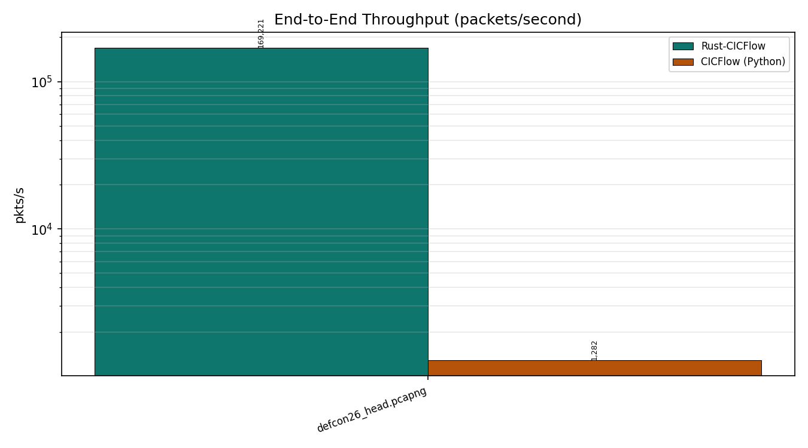
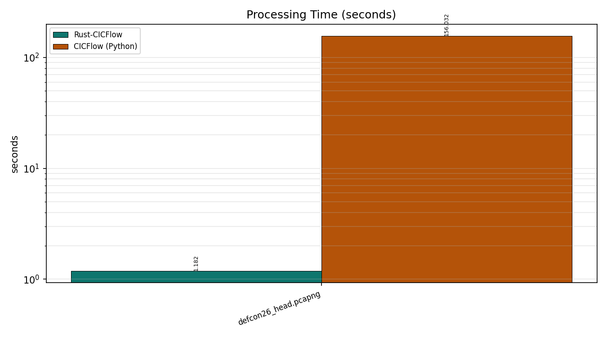
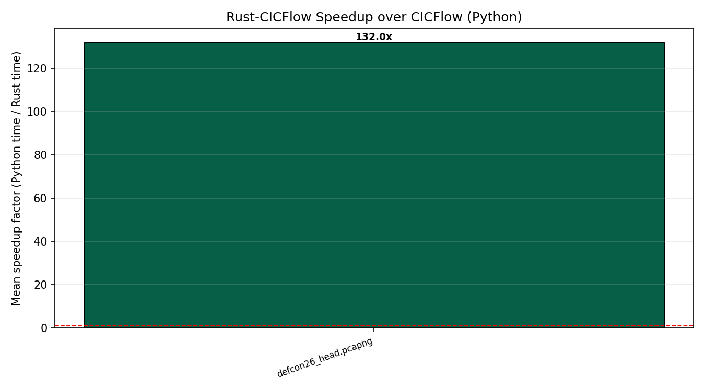
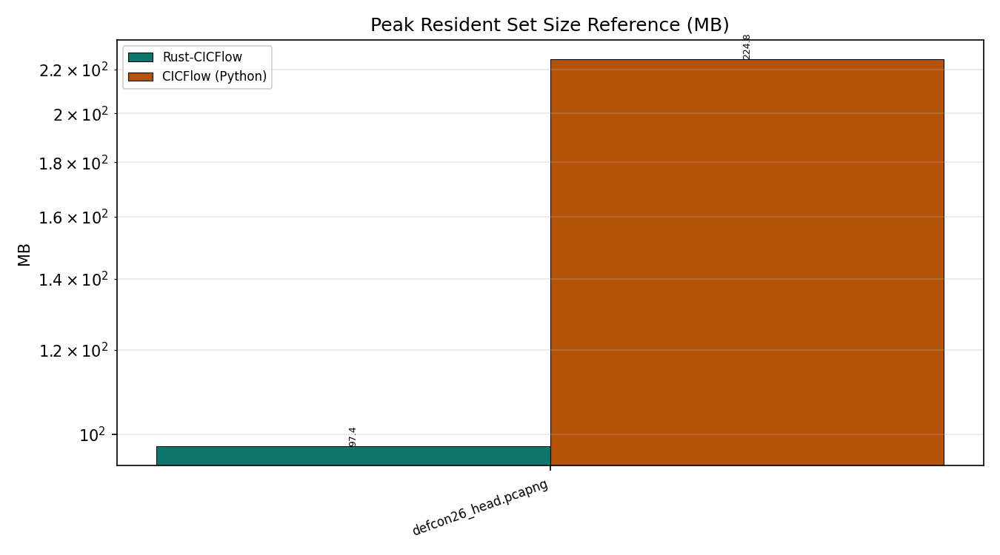
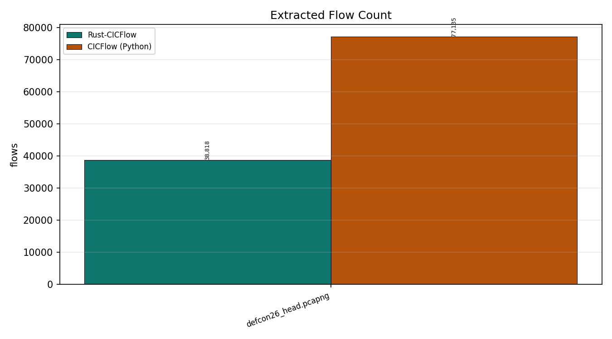
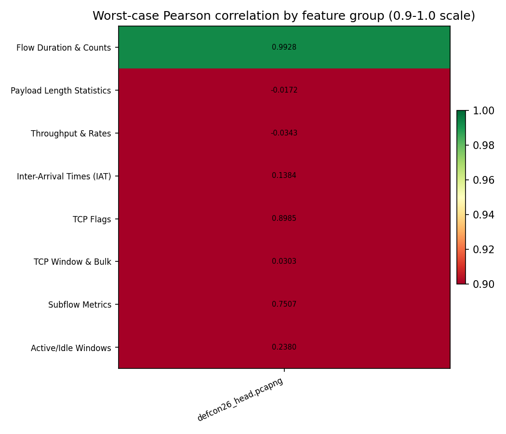
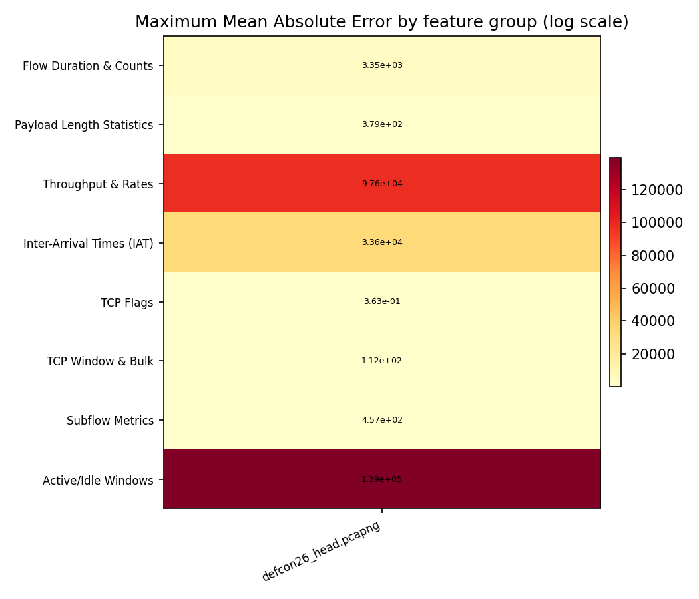

# CICFlow vs Rust-CICFlow — Experimental Comparison Report

**Platform:** `Zephyrus G14, Ryzen 7 6800HS, 40.960MB RAM`  
**Date/Time:** 2026-09-23 02:38:37  
**System:** Windows 10 (AMD64) — AMD64 Family 25 Model 68 Stepping 1, AuthenticAMD  
**Python:** 3.11.9  ·  **Rust:** cargo 1.98.0 (797e8a9bc 2026-08-05)  
**CICFlow (Python) package:** 0.2.0  
**Flags:** reps=2, threads=1, flow-timeout=120000000, activity-timeout=5000000, min-packets-per-flow=2, compat=False

---

## 1. Datasets

| Dataset | Size | Packets | Rust flows | Python flows |
|---|---|---|---|---|
| defcon26_head.pcapng | 27.0 MB | 200000 | 38818 | 77135 |

---

## 2. Throughput & Processing Time

| Dataset | Packets | Rust time (s) | Python time (s) | Rust (pkts/s) | Python (pkts/s) | Speedup |
|---|---|---|---|---|---|---|
| defcon26_head.pcapng | 200000 | 1.1819 | 156.0321 | 169,221 | 1,282 | 132.0x |

### Throughput comparison

### Processing time comparison

### Speedup

---

## 3. Memory

| Dataset | Rust peak RSS (MB) | Python peak RSS (MB) | Ratio (Python/Rust) |
|---|---|---|---|
| defcon26_head.pcapng | 97.43 | 224.80 | 2.3x |

### Memory comparison

---

## 4. Flow Extraction

---

## 5. Feature Concordance (Rust vs Python)

| Dataset | Rust flows | Python flows | Matched | Features | Exact | Concordant | Discrepant | Mean r | Mean MAE |
|---|---|---|---|---|---|---|---|---|---|
| defcon26_head.pcapng | 38818 | 38567 | 38038 | 76 | 3 | 16 | 57 | 0.8375 | 10365.9855 |

### Pearson correlation heatmap (by feature group)

### MAE heatmap (by feature group)

---

### Feature-by-feature concordance — `defcon26_head.pcapng`

| Feature | Group | Flows | MAE | Max diff | Pearson r | Status |
|---|---|---|---|---|---|---|
| Flow Duration | Flow Duration & Counts | n=38038 | 3.3483e+03 | 3.3626e+07 | 0.9973 | DISCREPANCY |
| Total Fwd Packet | Flow Duration & Counts | n=38038 | 7.4163e-02 | 1.0000e+01 | 0.9985 | DISCREPANCY |
| Total Bwd packets | Flow Duration & Counts | n=38038 | 1.1226e-02 | 1.5000e+01 | 0.9939 | DISCREPANCY |
| Total Length of Fwd Packet | Payload Length Statistics | n=38038 | 3.3693e+02 | 1.0898e+04 | 0.9985 | DISCREPANCY |
| Total Length of Bwd Packet | Payload Length Statistics | n=38038 | 1.1898e+01 | 1.2922e+04 | 0.9604 | DISCREPANCY |
| Fwd Packet Length Max | Payload Length Statistics | n=38038 | 7.3064e+01 | 9.1900e+02 | 0.9988 | DISCREPANCY |
| Fwd Packet Length Min | Payload Length Statistics | n=38038 | 6.4256e+01 | 1.3030e+03 | -0.0172 | DISCREPANCY |
| Fwd Packet Length Mean | Payload Length Statistics | n=38038 | 6.7350e+01 | 1.2040e+03 | 0.9597 | DISCREPANCY |
| Fwd Packet Length Std | Payload Length Statistics | n=38038 | 3.8866e+00 | 1.7587e+02 | 0.9982 | DISCREPANCY |
| Bwd Packet Length Max | Payload Length Statistics | n=38038 | 1.5819e+00 | 1.6990e+03 | 0.9969 | DISCREPANCY |
| Bwd Packet Length Min | Payload Length Statistics | n=38038 | 1.4517e+00 | 7.4000e+01 | 1.0000 | CONCORDANT |
| Bwd Packet Length Mean | Payload Length Statistics | n=38038 | 1.3250e+00 | 8.6147e+02 | 0.9753 | DISCREPANCY |
| Bwd Packet Length Std | Payload Length Statistics | n=38038 | 9.0968e-01 | 6.5871e+02 | 0.9949 | DISCREPANCY |
| Flow Bytes/s | Throughput & Rates | n=38038 | 9.7610e+04 | 2.8363e+05 | -0.0343 | DISCREPANCY |
| Flow Packets/s | Throughput & Rates | n=38038 | 5.3392e+00 | 6.7945e+02 | 0.9996 | CONCORDANT |
| Flow IAT Mean | Inter-Arrival Times (IAT) | n=38038 | 4.4887e+03 | 2.0335e+07 | 0.9039 | DISCREPANCY |
| Flow IAT Std | Inter-Arrival Times (IAT) | n=38038 | 8.1769e+03 | 9.6623e+06 | 0.9919 | DISCREPANCY |
| Flow IAT Max | Inter-Arrival Times (IAT) | n=38038 | 9.4485e+02 | 3.3614e+07 | 0.9951 | DISCREPANCY |
| Flow IAT Min | Inter-Arrival Times (IAT) | n=38038 | 7.1188e+02 | 1.0496e+07 | 0.1384 | DISCREPANCY |
| Fwd IAT Total | Inter-Arrival Times (IAT) | n=38038 | 1.2167e+04 | 7.5324e+07 | 0.9737 | DISCREPANCY |
| Fwd IAT Mean | Inter-Arrival Times (IAT) | n=38038 | 6.8770e+03 | 2.5108e+07 | 0.9362 | DISCREPANCY |
| Fwd IAT Std | Inter-Arrival Times (IAT) | n=38038 | 1.6423e+04 | 1.6429e+07 | 0.9780 | DISCREPANCY |
| Fwd IAT Max | Inter-Arrival Times (IAT) | n=38038 | 6.5867e+03 | 4.2773e+07 | 0.9744 | DISCREPANCY |
| Fwd IAT Min | Inter-Arrival Times (IAT) | n=38038 | 1.1149e+03 | 1.0495e+07 | 0.2746 | DISCREPANCY |
| Bwd IAT Total | Inter-Arrival Times (IAT) | n=38038 | 2.4044e+04 | 8.8623e+07 | 0.9159 | DISCREPANCY |
| Bwd IAT Mean | Inter-Arrival Times (IAT) | n=38038 | 2.6595e+04 | 2.0217e+07 | 0.8662 | DISCREPANCY |
| Bwd IAT Std | Inter-Arrival Times (IAT) | n=38038 | 2.3561e+04 | 1.7785e+07 | 0.8133 | DISCREPANCY |
| Bwd IAT Max | Inter-Arrival Times (IAT) | n=38038 | 1.4148e+04 | 4.3008e+07 | 0.9471 | DISCREPANCY |
| Bwd IAT Min | Inter-Arrival Times (IAT) | n=38038 | 3.3595e+04 | 2.0220e+07 | 0.3623 | DISCREPANCY |
| Fwd PSH Flags | TCP Flags | n=38038 | 3.6306e-01 | 8.6000e+01 | 1.0000 | CONCORDANT |
| Bwd PSH Flags | TCP Flags | n=38038 | 4.7584e-02 | 1.3000e+01 | 1.0000 | CONCORDANT |
| Fwd URG Flags | TCP Flags | n=38038 | 0.0000e+00 | 0.0000e+00 | 1.0000 | EXACT |
| Bwd URG Flags | TCP Flags | n=38038 | 0.0000e+00 | 0.0000e+00 | 1.0000 | EXACT |
| Fwd Header Length | Payload Length Statistics | n=38038 | 6.3930e+01 | 1.9880e+03 | 0.9968 | DISCREPANCY |
| Bwd Header Length | Payload Length Statistics | n=38038 | 1.6311e+00 | 8.0400e+02 | 0.9826 | DISCREPANCY |
| Fwd Packets/s | Flow Duration & Counts | n=38038 | 5.3363e+00 | 6.7945e+02 | 0.9996 | CONCORDANT |
| Bwd Packets/s | Flow Duration & Counts | n=38038 | 8.0014e-03 | 1.4242e+02 | 0.9928 | DISCREPANCY |
| Packet Length Min | Payload Length Statistics | n=38038 | 6.4246e+01 | 1.3030e+03 | -0.0172 | DISCREPANCY |
| Packet Length Max | Payload Length Statistics | n=38038 | 7.2951e+01 | 8.9100e+02 | 0.9997 | CONCORDANT |
| Packet Length Mean | Payload Length Statistics | n=38038 | 6.7214e+01 | 6.4468e+02 | 0.9885 | DISCREPANCY |
| Packet Length Std | Payload Length Statistics | n=38038 | 4.2197e+00 | 6.5702e+02 | 0.9957 | DISCREPANCY |
| Packet Length Variance | Payload Length Statistics | n=38038 | 3.7868e+02 | 4.3168e+05 | 0.9936 | DISCREPANCY |
| FIN Flag Count | TCP Flags | n=38038 | 1.6562e-03 | 3.0000e+00 | 0.9896 | DISCREPANCY |
| SYN Flag Count | TCP Flags | n=38038 | 2.6289e-04 | 3.0000e+00 | 0.9939 | DISCREPANCY |
| RST Flag Count | TCP Flags | n=38038 | 6.4882e-02 | 1.0000e+01 | 0.8985 | DISCREPANCY |
| PSH Flag Count | TCP Flags | n=38038 | 5.7837e-04 | 6.0000e+00 | 0.9999 | CONCORDANT |
| ACK Flag Count | TCP Flags | n=38038 | 2.0480e-02 | 1.4000e+01 | 0.9994 | CONCORDANT |
| URG Flag Count | TCP Flags | n=38038 | 0.0000e+00 | 0.0000e+00 | 1.0000 | EXACT |
| CWR Flag Count | TCP Flags | n=38038 | 3.0759e-03 | 3.0000e+00 | 1.0000 | CONCORDANT |
| ECE Flag Count | TCP Flags | n=38038 | 5.2579e-05 | 2.0000e+00 | 0.9964 | DISCREPANCY |
| Down/Up Ratio | TCP Flags | n=38038 | 2.7605e-03 | 3.7500e+00 | 0.9621 | DISCREPANCY |
| Average Packet Size | Payload Length Statistics | n=38038 | 6.7214e+01 | 6.4468e+02 | 0.9885 | DISCREPANCY |
| Fwd Segment Size Avg | Throughput & Rates | n=38038 | 6.7350e+01 | 1.2040e+03 | 0.9597 | DISCREPANCY |
| Bwd Segment Size Avg | Throughput & Rates | n=38038 | 1.3250e+00 | 8.6147e+02 | 0.9753 | DISCREPANCY |
| Fwd Bytes/Bulk Avg | TCP Window & Bulk | n=38038 | 8.7703e+01 | 3.1751e+04 | 0.8930 | DISCREPANCY |
| Fwd Packet/Bulk Avg | TCP Window & Bulk | n=38038 | 1.1806e-01 | 6.3000e+01 | 0.8466 | DISCREPANCY |
| Fwd Bulk Rate Avg | TCP Window & Bulk | n=38038 | 1.1225e+02 | 1.3693e+06 | 0.0303 | DISCREPANCY |
| Bwd Bytes/Bulk Avg | TCP Window & Bulk | n=38038 | 4.6655e+00 | 8.0290e+03 | 0.3422 | DISCREPANCY |
| Bwd Packet/Bulk Avg | TCP Window & Bulk | n=38038 | 1.2856e-02 | 1.1000e+01 | 0.2902 | DISCREPANCY |
| Bwd Bulk Rate Avg | TCP Window & Bulk | n=38038 | 2.8186e+00 | 1.1637e+04 | 0.3570 | DISCREPANCY |
| Subflow Fwd Packets | Subflow Metrics | n=38038 | 4.8681e+00 | 1.4500e+02 | 0.7507 | DISCREPANCY |
| Subflow Fwd Bytes | Subflow Metrics | n=38038 | 4.5656e+02 | 4.7927e+04 | 0.9033 | DISCREPANCY |
| Subflow Bwd Packets | Subflow Metrics | n=38038 | 9.0594e-02 | 4.1000e+01 | 0.8029 | DISCREPANCY |
| Subflow Bwd Bytes | Subflow Metrics | n=38038 | 2.7992e+01 | 1.2922e+04 | 0.7998 | DISCREPANCY |
| FWD Init Win Bytes | TCP Window & Bulk | n=38038 | 6.7990e+00 | 6.5308e+04 | 0.9860 | DISCREPANCY |
| Bwd Init Win Bytes | TCP Window & Bulk | n=38038 | 1.8618e-01 | 3.8760e+03 | 0.9992 | CONCORDANT |
| Fwd Act Data Pkts | Throughput & Rates | n=38038 | 3.4176e-04 | 2.0000e+00 | 1.0000 | CONCORDANT |
| Fwd Seg Size Min | Throughput & Rates | n=38038 | 1.0208e+01 | 2.0000e+01 | 1.0000 | CONCORDANT |
| Active Mean | Active/Idle Windows | n=38038 | 3.2426e+04 | 2.1775e+07 | 1.0000 | CONCORDANT |
| Active Std | Active/Idle Windows | n=38038 | 1.5896e+03 | 8.8455e+06 | 1.0000 | CONCORDANT |
| Active Max | Active/Idle Windows | n=38038 | 3.3595e+04 | 2.1775e+07 | 1.0000 | CONCORDANT |
| Active Min | Active/Idle Windows | n=38038 | 3.1299e+04 | 2.1775e+07 | 1.0000 | CONCORDANT |
| Idle Mean | Active/Idle Windows | n=38038 | 1.3208e+05 | 4.9978e+07 | 0.4012 | DISCREPANCY |
| Idle Std | Active/Idle Windows | n=38038 | 9.8721e+03 | 2.0597e+07 | 0.8762 | DISCREPANCY |
| Idle Max | Active/Idle Windows | n=38038 | 1.3919e+05 | 4.9978e+07 | 0.5432 | DISCREPANCY |
| Idle Min | Active/Idle Windows | n=38038 | 1.2530e+05 | 4.9978e+07 | 0.2380 | DISCREPANCY |