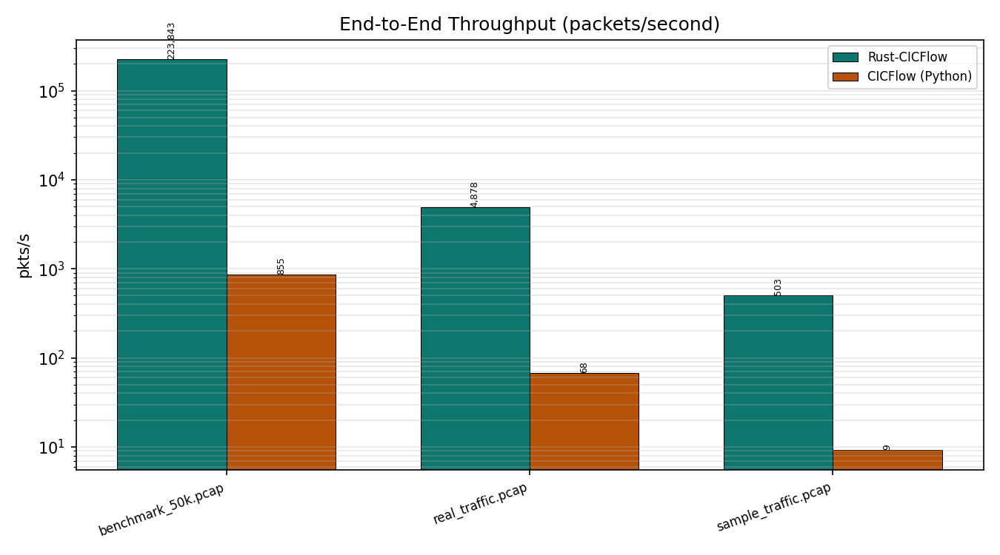
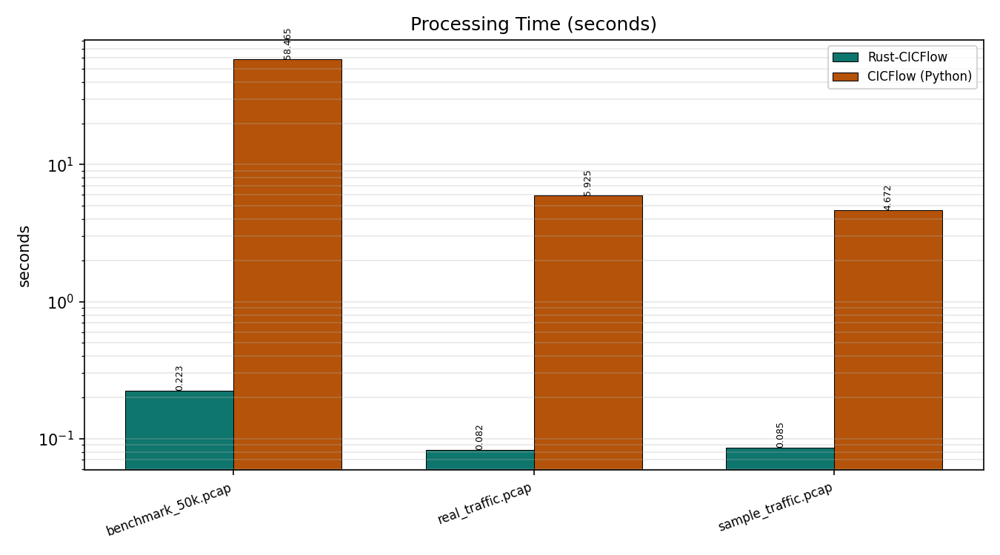
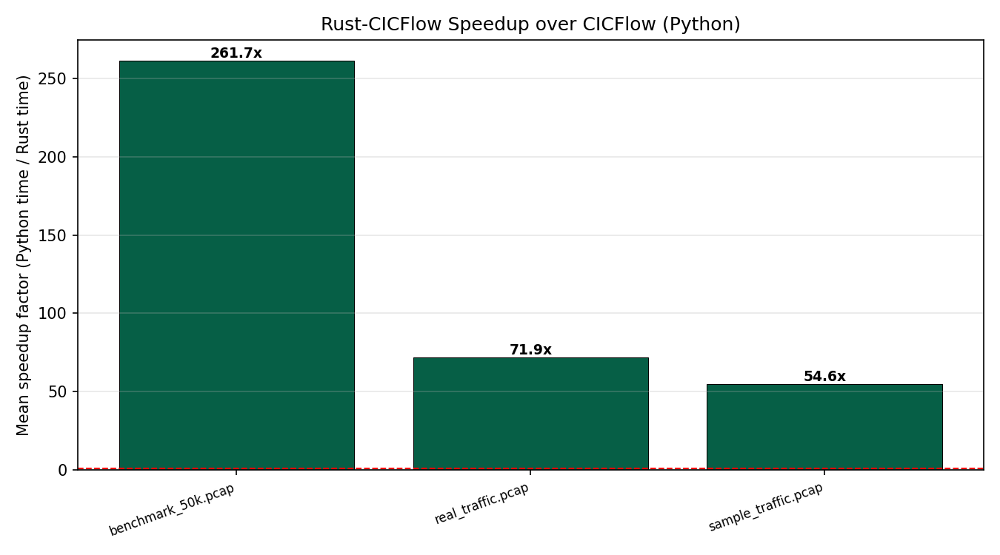
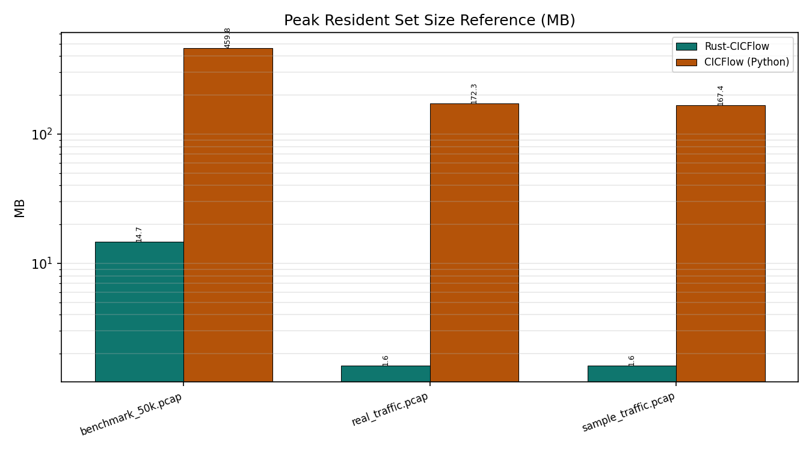
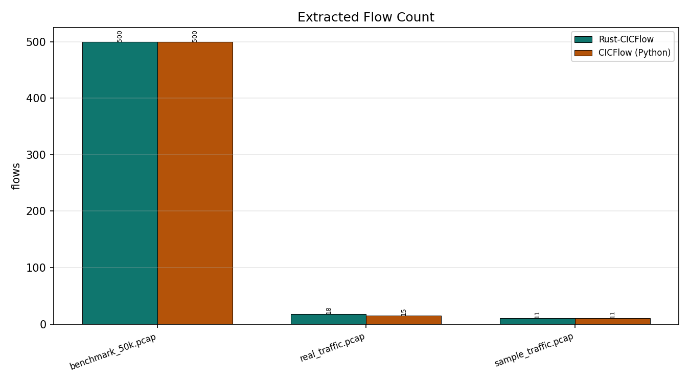
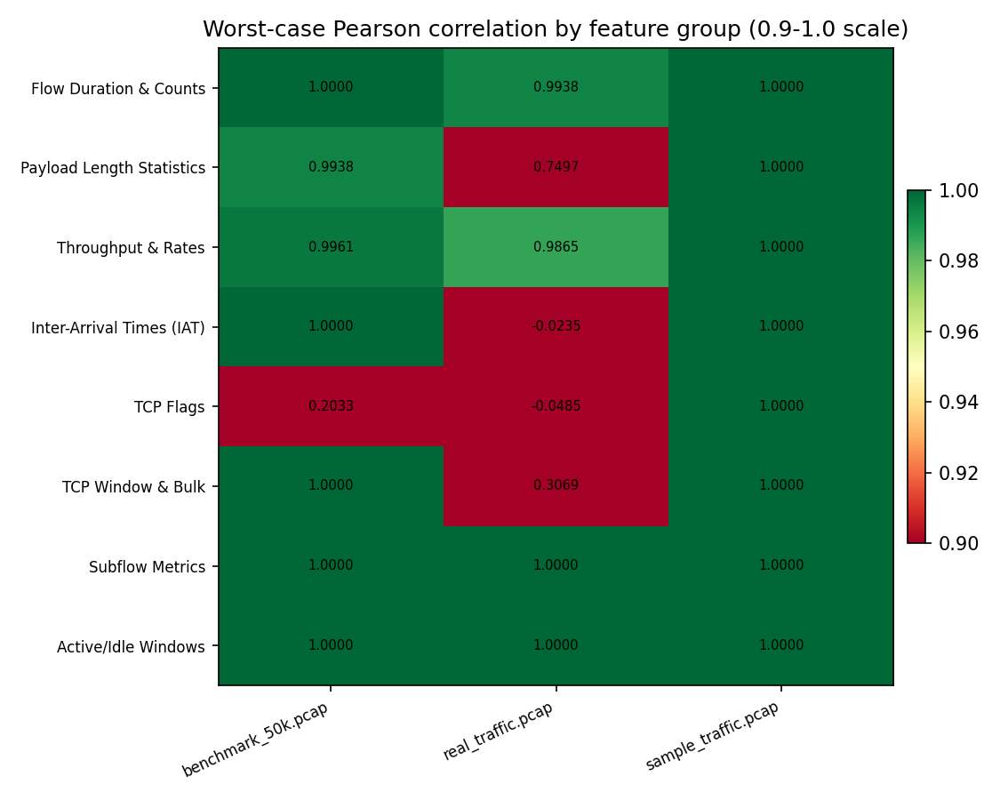
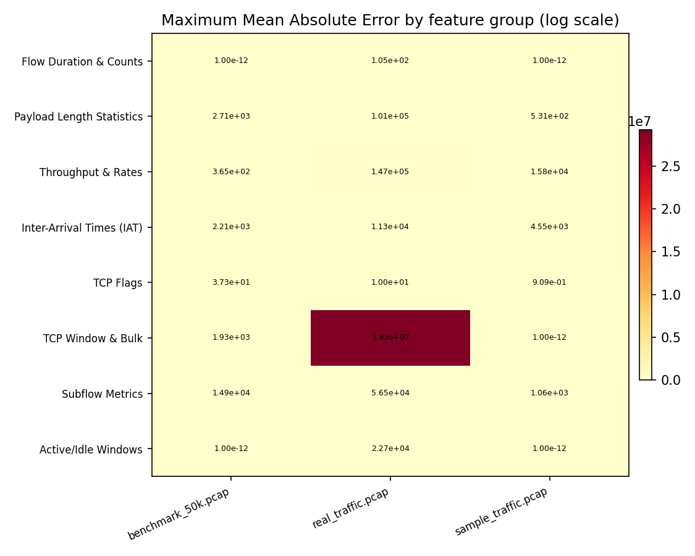

# CICFlow vs Rust-CICFlow — Experimental Comparison Report

**Platform:** `Local_Computer`  
**Date/Time:** 2026-09-24 18:41:30  
**System:** Windows 10 (AMD64) — AMD64 Family 25 Model 68 Stepping 1, AuthenticAMD  
**Python:** 3.11.9  ·  **Rust:** cargo 1.98.0 (797e8a9bc 2026-08-05)  
**CICFlow (Python) package:** 0.2.0  
**Flags:** reps=2, threads=1, flow-timeout=120000000, activity-timeout=5000000, min-packets-per-flow=2, compat=False

---

## 1. Datasets

| Dataset | Size | Packets | Rust flows | Python flows |
|---|---|---|---|---|
| benchmark_50k.pcap | 15.6 MB | 50000 | 500 | 500 |
| real_traffic.pcap | 878.3 KB | 402 | 18 | 15 |
| sample_traffic.pcap | 19.0 KB | 43 | 11 | 11 |

---

## 2. Throughput & Processing Time

| Dataset | Packets | Rust time (s) | Python time (s) | Rust (pkts/s) | Python (pkts/s) | Speedup |
|---|---|---|---|---|---|---|
| benchmark_50k.pcap | 50000 | 0.2234 | 58.4645 | 223,843 | 855 | 261.7x |
| real_traffic.pcap | 402 | 0.0824 | 5.9250 | 4,878 | 68 | 71.9x |
| sample_traffic.pcap | 43 | 0.0855 | 4.6723 | 503 | 9 | 54.6x |

### Throughput comparison

### Processing time comparison

### Speedup

---

## 3. Memory

| Dataset | Rust peak RSS (MB) | Python peak RSS (MB) | Ratio (Python/Rust) |
|---|---|---|---|
| benchmark_50k.pcap | 14.71 | 459.81 | 31.2x |
| real_traffic.pcap | 1.61 | 172.31 | 106.9x |
| sample_traffic.pcap | 1.62 | 167.40 | 103.5x |

### Memory comparison

---

## 4. Flow Extraction

---

## 5. Feature Concordance (Rust vs Python)

| Dataset | Rust flows | Python flows | Matched | Features | Exact | Concordant | Discrepant | Mean r | Mean MAE |
|---|---|---|---|---|---|---|---|---|---|
| benchmark_50k.pcap | 500 | 500 | 500 | 76 | 41 | 31 | 4 | 0.9893 | 630.1385 |
| real_traffic.pcap | 18 | 15 | 15 | 76 | 14 | 39 | 23 | 0.9420 | 391219.3519 |
| sample_traffic.pcap | 11 | 11 | 11 | 76 | 44 | 32 | 0 | 1.0000 | 425.7770 |

### Pearson correlation heatmap (by feature group)

### MAE heatmap (by feature group)

---

### Feature-by-feature concordance — `benchmark_50k.pcap`

| Feature | Group | Flows | MAE | Max diff | Pearson r | Status |
|---|---|---|---|---|---|---|
| Flow Duration | Flow Duration & Counts | n=500 | 0.0000e+00 | 0.0000e+00 | 1.0000 | EXACT |
| Total Fwd Packet | Flow Duration & Counts | n=500 | 0.0000e+00 | 0.0000e+00 | 1.0000 | EXACT |
| Total Bwd packets | Flow Duration & Counts | n=500 | 0.0000e+00 | 0.0000e+00 | 1.0000 | EXACT |
| Total Length of Fwd Packet | Payload Length Statistics | n=500 | 2.7149e+03 | 3.5100e+03 | 0.9938 | DISCREPANCY |
| Total Length of Bwd Packet | Payload Length Statistics | n=500 | 2.6851e+03 | 3.5640e+03 | 0.9950 | DISCREPANCY |
| Fwd Packet Length Max | Payload Length Statistics | n=500 | 5.4000e+01 | 5.4000e+01 | 1.0000 | CONCORDANT |
| Fwd Packet Length Min | Payload Length Statistics | n=500 | 5.4000e+01 | 5.4000e+01 | 1.0000 | CONCORDANT |
| Fwd Packet Length Mean | Payload Length Statistics | n=500 | 5.4000e+01 | 5.4000e+01 | 1.0000 | CONCORDANT |
| Fwd Packet Length Std | Payload Length Statistics | n=500 | 2.1737e+00 | 3.1420e+00 | 0.9998 | CONCORDANT |
| Bwd Packet Length Max | Payload Length Statistics | n=500 | 5.4000e+01 | 5.4000e+01 | 1.0000 | CONCORDANT |
| Bwd Packet Length Min | Payload Length Statistics | n=500 | 5.4000e+01 | 5.4000e+01 | 1.0000 | CONCORDANT |
| Bwd Packet Length Mean | Payload Length Statistics | n=500 | 5.4000e+01 | 5.4000e+01 | 1.0000 | CONCORDANT |
| Bwd Packet Length Std | Payload Length Statistics | n=500 | 2.1942e+00 | 3.4612e+00 | 0.9998 | CONCORDANT |
| Flow Bytes/s | Throughput & Rates | n=500 | 3.6547e+02 | 3.6547e+02 | 1.0000 | CONCORDANT |
| Flow Packets/s | Throughput & Rates | n=500 | 0.0000e+00 | 0.0000e+00 | 1.0000 | EXACT |
| Flow IAT Mean | Inter-Arrival Times (IAT) | n=500 | 2.0664e-11 | 5.8208e-11 | 1.0000 | EXACT |
| Flow IAT Std | Inter-Arrival Times (IAT) | n=500 | 1.6225e-03 | 1.6609e-03 | 1.0000 | CONCORDANT |
| Flow IAT Max | Inter-Arrival Times (IAT) | n=500 | 0.0000e+00 | 0.0000e+00 | 1.0000 | EXACT |
| Flow IAT Min | Inter-Arrival Times (IAT) | n=500 | 0.0000e+00 | 0.0000e+00 | 1.0000 | EXACT |
| Fwd IAT Total | Inter-Arrival Times (IAT) | n=500 | 0.0000e+00 | 0.0000e+00 | 1.0000 | EXACT |
| Fwd IAT Mean | Inter-Arrival Times (IAT) | n=500 | 4.6392e-11 | 2.3283e-10 | 1.0000 | EXACT |
| Fwd IAT Std | Inter-Arrival Times (IAT) | n=500 | 2.2082e+03 | 5.6119e+03 | 1.0000 | CONCORDANT |
| Fwd IAT Max | Inter-Arrival Times (IAT) | n=500 | 0.0000e+00 | 0.0000e+00 | 1.0000 | EXACT |
| Fwd IAT Min | Inter-Arrival Times (IAT) | n=500 | 0.0000e+00 | 0.0000e+00 | 1.0000 | EXACT |
| Bwd IAT Total | Inter-Arrival Times (IAT) | n=500 | 0.0000e+00 | 0.0000e+00 | 1.0000 | EXACT |
| Bwd IAT Mean | Inter-Arrival Times (IAT) | n=500 | 4.6508e-11 | 2.3283e-10 | 1.0000 | EXACT |
| Bwd IAT Std | Inter-Arrival Times (IAT) | n=500 | 2.2023e+03 | 6.0632e+03 | 1.0000 | CONCORDANT |
| Bwd IAT Max | Inter-Arrival Times (IAT) | n=500 | 0.0000e+00 | 0.0000e+00 | 1.0000 | EXACT |
| Bwd IAT Min | Inter-Arrival Times (IAT) | n=500 | 0.0000e+00 | 0.0000e+00 | 1.0000 | EXACT |
| Fwd PSH Flags | TCP Flags | n=500 | 3.7000e+01 | 5.0000e+01 | 0.2033 | DISCREPANCY |
| Bwd PSH Flags | TCP Flags | n=500 | 3.7282e+01 | 5.3000e+01 | 1.0000 | CONCORDANT |
| Fwd URG Flags | TCP Flags | n=500 | 0.0000e+00 | 0.0000e+00 | 1.0000 | EXACT |
| Bwd URG Flags | TCP Flags | n=500 | 0.0000e+00 | 0.0000e+00 | 1.0000 | EXACT |
| Fwd Header Length | Payload Length Statistics | n=500 | 0.0000e+00 | 0.0000e+00 | 1.0000 | EXACT |
| Bwd Header Length | Payload Length Statistics | n=500 | 0.0000e+00 | 0.0000e+00 | 1.0000 | EXACT |
| Fwd Packets/s | Flow Duration & Counts | n=500 | 0.0000e+00 | 0.0000e+00 | 1.0000 | EXACT |
| Bwd Packets/s | Flow Duration & Counts | n=500 | 0.0000e+00 | 0.0000e+00 | 1.0000 | EXACT |
| Packet Length Min | Payload Length Statistics | n=500 | 5.4000e+01 | 5.4000e+01 | 1.0000 | CONCORDANT |
| Packet Length Max | Payload Length Statistics | n=500 | 5.4000e+01 | 5.4000e+01 | 1.0000 | CONCORDANT |
| Packet Length Mean | Payload Length Statistics | n=500 | 5.4000e+01 | 5.4000e+01 | 1.0000 | CONCORDANT |
| Packet Length Std | Payload Length Statistics | n=500 | 1.0781e+00 | 1.1731e+00 | 1.0000 | CONCORDANT |
| Packet Length Variance | Payload Length Statistics | n=500 | 4.6319e+02 | 5.4770e+02 | 1.0000 | CONCORDANT |
| FIN Flag Count | TCP Flags | n=500 | 0.0000e+00 | 0.0000e+00 | 1.0000 | EXACT |
| SYN Flag Count | TCP Flags | n=500 | 0.0000e+00 | 0.0000e+00 | 1.0000 | EXACT |
| RST Flag Count | TCP Flags | n=500 | 0.0000e+00 | 0.0000e+00 | 1.0000 | EXACT |
| PSH Flag Count | TCP Flags | n=500 | 0.0000e+00 | 0.0000e+00 | 1.0000 | EXACT |
| ACK Flag Count | TCP Flags | n=500 | 0.0000e+00 | 0.0000e+00 | 1.0000 | EXACT |
| URG Flag Count | TCP Flags | n=500 | 0.0000e+00 | 0.0000e+00 | 1.0000 | EXACT |
| CWR Flag Count | TCP Flags | n=500 | 0.0000e+00 | 0.0000e+00 | 1.0000 | EXACT |
| ECE Flag Count | TCP Flags | n=500 | 0.0000e+00 | 0.0000e+00 | 1.0000 | EXACT |
| Down/Up Ratio | TCP Flags | n=500 | 0.0000e+00 | 0.0000e+00 | 1.0000 | EXACT |
| Average Packet Size | Payload Length Statistics | n=500 | 5.4000e+01 | 5.4000e+01 | 1.0000 | CONCORDANT |
| Fwd Segment Size Avg | Throughput & Rates | n=500 | 5.4000e+01 | 5.4000e+01 | 1.0000 | CONCORDANT |
| Bwd Segment Size Avg | Throughput & Rates | n=500 | 5.4000e+01 | 5.4000e+01 | 1.0000 | CONCORDANT |
| Fwd Bytes/Bulk Avg | TCP Window & Bulk | n=500 | 1.4965e+03 | 3.8400e+03 | 1.0000 | CONCORDANT |
| Fwd Packet/Bulk Avg | TCP Window & Bulk | n=500 | 4.4220e+00 | 1.2000e+01 | 1.0000 | CONCORDANT |
| Fwd Bulk Rate Avg | TCP Window & Bulk | n=500 | 1.9323e+03 | 4.2880e+03 | 1.0000 | CONCORDANT |
| Bwd Bytes/Bulk Avg | TCP Window & Bulk | n=500 | 1.4766e+03 | 3.5200e+03 | 1.0000 | CONCORDANT |
| Bwd Packet/Bulk Avg | TCP Window & Bulk | n=500 | 4.4200e+00 | 1.3000e+01 | 1.0000 | CONCORDANT |
| Bwd Bulk Rate Avg | TCP Window & Bulk | n=500 | 1.9102e+03 | 4.1450e+03 | 1.0000 | CONCORDANT |
| Subflow Fwd Packets | Subflow Metrics | n=500 | 5.0276e+01 | 6.5000e+01 | 1.0000 | CONCORDANT |
| Subflow Fwd Bytes | Subflow Metrics | n=500 | 1.4915e+04 | 2.0870e+04 | 1.0000 | CONCORDANT |
| Subflow Bwd Packets | Subflow Metrics | n=500 | 4.9724e+01 | 6.6000e+01 | 1.0000 | CONCORDANT |
| Subflow Bwd Bytes | Subflow Metrics | n=500 | 1.4684e+04 | 2.1608e+04 | 1.0000 | CONCORDANT |
| FWD Init Win Bytes | TCP Window & Bulk | n=500 | 0.0000e+00 | 0.0000e+00 | 1.0000 | EXACT |
| Bwd Init Win Bytes | TCP Window & Bulk | n=500 | 0.0000e+00 | 0.0000e+00 | 1.0000 | EXACT |
| Fwd Act Data Pkts | Throughput & Rates | n=500 | 7.6200e-01 | 1.0000e+00 | 0.9961 | DISCREPANCY |
| Fwd Seg Size Min | Throughput & Rates | n=500 | 0.0000e+00 | 0.0000e+00 | 1.0000 | EXACT |
| Active Mean | Active/Idle Windows | n=500 | 0.0000e+00 | 0.0000e+00 | 1.0000 | EXACT |
| Active Std | Active/Idle Windows | n=500 | 0.0000e+00 | 0.0000e+00 | 1.0000 | EXACT |
| Active Max | Active/Idle Windows | n=500 | 0.0000e+00 | 0.0000e+00 | 1.0000 | EXACT |
| Active Min | Active/Idle Windows | n=500 | 0.0000e+00 | 0.0000e+00 | 1.0000 | EXACT |
| Idle Mean | Active/Idle Windows | n=500 | 0.0000e+00 | 0.0000e+00 | 1.0000 | EXACT |
| Idle Std | Active/Idle Windows | n=500 | 0.0000e+00 | 0.0000e+00 | 1.0000 | EXACT |
| Idle Max | Active/Idle Windows | n=500 | 0.0000e+00 | 0.0000e+00 | 1.0000 | EXACT |
| Idle Min | Active/Idle Windows | n=500 | 0.0000e+00 | 0.0000e+00 | 1.0000 | EXACT |

---

### Feature-by-feature concordance — `real_traffic.pcap`

| Feature | Group | Flows | MAE | Max diff | Pearson r | Status |
|---|---|---|---|---|---|---|
| Flow Duration | Flow Duration & Counts | n=15 | 1.5000e+01 | 5.9000e+01 | 1.0000 | CONCORDANT |
| Total Fwd Packet | Flow Duration & Counts | n=15 | 6.0000e-01 | 2.0000e+00 | 0.9998 | CONCORDANT |
| Total Bwd packets | Flow Duration & Counts | n=15 | 1.3333e-01 | 1.0000e+00 | 0.9999 | CONCORDANT |
| Total Length of Fwd Packet | Payload Length Statistics | n=15 | 9.0827e+02 | 4.1600e+03 | 0.9015 | DISCREPANCY |
| Total Length of Bwd Packet | Payload Length Statistics | n=15 | 9.8827e+02 | 4.8320e+03 | 1.0000 | CONCORDANT |
| Fwd Packet Length Max | Payload Length Statistics | n=15 | 6.2400e+01 | 7.2000e+01 | 0.9999 | CONCORDANT |
| Fwd Packet Length Min | Payload Length Statistics | n=15 | 6.0800e+01 | 7.2000e+01 | 0.9657 | DISCREPANCY |
| Fwd Packet Length Mean | Payload Length Statistics | n=15 | 5.9832e+01 | 7.3600e+01 | 0.9865 | DISCREPANCY |
| Fwd Packet Length Std | Payload Length Statistics | n=15 | 9.5346e+00 | 4.3626e+01 | 0.9993 | CONCORDANT |
| Bwd Packet Length Max | Payload Length Statistics | n=15 | 6.2400e+01 | 7.2000e+01 | 1.0000 | CONCORDANT |
| Bwd Packet Length Min | Payload Length Statistics | n=15 | 6.2400e+01 | 7.2000e+01 | 0.9894 | DISCREPANCY |
| Bwd Packet Length Mean | Payload Length Statistics | n=15 | 6.1179e+01 | 7.4000e+01 | 1.0000 | CONCORDANT |
| Bwd Packet Length Std | Payload Length Statistics | n=15 | 2.6725e+01 | 8.9167e+01 | 0.9999 | CONCORDANT |
| Flow Bytes/s | Throughput & Rates | n=15 | 1.4716e+05 | 7.5995e+05 | 0.9947 | DISCREPANCY |
| Flow Packets/s | Throughput & Rates | n=15 | 1.7169e+02 | 1.8592e+03 | 0.9958 | DISCREPANCY |
| Flow IAT Mean | Inter-Arrival Times (IAT) | n=15 | 9.6827e+01 | 5.1372e+02 | 0.9996 | CONCORDANT |
| Flow IAT Std | Inter-Arrival Times (IAT) | n=15 | 5.4445e+02 | 2.4068e+03 | 0.9982 | DISCREPANCY |
| Flow IAT Max | Inter-Arrival Times (IAT) | n=15 | 0.0000e+00 | 0.0000e+00 | 1.0000 | EXACT |
| Flow IAT Min | Inter-Arrival Times (IAT) | n=15 | 3.1333e+00 | 1.8000e+01 | 0.9974 | DISCREPANCY |
| Fwd IAT Total | Inter-Arrival Times (IAT) | n=15 | 1.1322e+04 | 6.4834e+04 | 0.9989 | DISCREPANCY |
| Fwd IAT Mean | Inter-Arrival Times (IAT) | n=15 | 4.6485e+02 | 3.2456e+03 | 0.9982 | DISCREPANCY |
| Fwd IAT Std | Inter-Arrival Times (IAT) | n=15 | 5.7758e+02 | 3.2371e+03 | 0.9992 | CONCORDANT |
| Fwd IAT Max | Inter-Arrival Times (IAT) | n=15 | 1.0887e+02 | 1.4160e+03 | 1.0000 | CONCORDANT |
| Fwd IAT Min | Inter-Arrival Times (IAT) | n=15 | 1.1927e+02 | 1.4160e+03 | -0.0235 | DISCREPANCY |
| Bwd IAT Total | Inter-Arrival Times (IAT) | n=15 | 2.7740e+02 | 1.4120e+03 | 1.0000 | CONCORDANT |
| Bwd IAT Mean | Inter-Arrival Times (IAT) | n=15 | 2.4736e+02 | 1.4120e+03 | 0.9990 | DISCREPANCY |
| Bwd IAT Std | Inter-Arrival Times (IAT) | n=15 | 3.6996e+02 | 2.7068e+03 | 0.9992 | CONCORDANT |
| Bwd IAT Max | Inter-Arrival Times (IAT) | n=15 | 2.4453e+02 | 1.4120e+03 | 1.0000 | CONCORDANT |
| Bwd IAT Min | Inter-Arrival Times (IAT) | n=15 | 2.4453e+02 | 1.4120e+03 | 0.3504 | DISCREPANCY |
| Fwd PSH Flags | TCP Flags | n=15 | 2.4667e+00 | 7.0000e+00 | -0.0485 | DISCREPANCY |
| Bwd PSH Flags | TCP Flags | n=15 | 1.0000e+01 | 6.2000e+01 | 1.0000 | CONCORDANT |
| Fwd URG Flags | TCP Flags | n=15 | 0.0000e+00 | 0.0000e+00 | 1.0000 | EXACT |
| Bwd URG Flags | TCP Flags | n=15 | 0.0000e+00 | 0.0000e+00 | 1.0000 | EXACT |
| Fwd Header Length | Payload Length Statistics | n=15 | 1.2987e+02 | 6.4000e+02 | 0.9999 | CONCORDANT |
| Bwd Header Length | Payload Length Statistics | n=15 | 1.5760e+02 | 8.1200e+02 | 0.9999 | CONCORDANT |
| Fwd Packets/s | Flow Duration & Counts | n=15 | 6.9919e+01 | 9.2828e+02 | 0.9941 | DISCREPANCY |
| Bwd Packets/s | Flow Duration & Counts | n=15 | 1.0518e+02 | 9.3095e+02 | 0.9938 | DISCREPANCY |
| Packet Length Min | Payload Length Statistics | n=15 | 6.0800e+01 | 7.2000e+01 | 0.7497 | DISCREPANCY |
| Packet Length Max | Payload Length Statistics | n=15 | 6.2400e+01 | 7.2000e+01 | 1.0000 | CONCORDANT |
| Packet Length Mean | Payload Length Statistics | n=15 | 5.0916e+01 | 7.2000e+01 | 1.0000 | CONCORDANT |
| Packet Length Std | Payload Length Statistics | n=15 | 1.9969e+01 | 6.4504e+01 | 1.0000 | CONCORDANT |
| Packet Length Variance | Payload Length Statistics | n=15 | 1.0150e+05 | 8.5573e+05 | 1.0000 | CONCORDANT |
| FIN Flag Count | TCP Flags | n=15 | 0.0000e+00 | 0.0000e+00 | 1.0000 | EXACT |
| SYN Flag Count | TCP Flags | n=15 | 0.0000e+00 | 0.0000e+00 | 1.0000 | EXACT |
| RST Flag Count | TCP Flags | n=15 | 2.6667e-01 | 2.0000e+00 | 1.0000 | CONCORDANT |
| PSH Flag Count | TCP Flags | n=15 | 0.0000e+00 | 0.0000e+00 | 1.0000 | EXACT |
| ACK Flag Count | TCP Flags | n=15 | 4.6667e-01 | 2.0000e+00 | 0.9999 | CONCORDANT |
| URG Flag Count | TCP Flags | n=15 | 0.0000e+00 | 0.0000e+00 | 1.0000 | EXACT |
| CWR Flag Count | TCP Flags | n=15 | 0.0000e+00 | 0.0000e+00 | 1.0000 | EXACT |
| ECE Flag Count | TCP Flags | n=15 | 0.0000e+00 | 0.0000e+00 | 1.0000 | EXACT |
| Down/Up Ratio | TCP Flags | n=15 | 4.5157e-02 | 2.0000e-01 | 0.9380 | DISCREPANCY |
| Average Packet Size | Payload Length Statistics | n=15 | 5.0916e+01 | 7.2000e+01 | 1.0000 | CONCORDANT |
| Fwd Segment Size Avg | Throughput & Rates | n=15 | 5.9832e+01 | 7.3600e+01 | 0.9865 | DISCREPANCY |
| Bwd Segment Size Avg | Throughput & Rates | n=15 | 6.1179e+01 | 7.4000e+01 | 1.0000 | CONCORDANT |
| Fwd Bytes/Bulk Avg | TCP Window & Bulk | n=15 | 0.0000e+00 | 0.0000e+00 | 1.0000 | EXACT |
| Fwd Packet/Bulk Avg | TCP Window & Bulk | n=15 | 0.0000e+00 | 0.0000e+00 | 1.0000 | EXACT |
| Fwd Bulk Rate Avg | TCP Window & Bulk | n=15 | 0.0000e+00 | 0.0000e+00 | 1.0000 | EXACT |
| Bwd Bytes/Bulk Avg | TCP Window & Bulk | n=15 | 3.8200e+04 | 5.2196e+05 | 0.8302 | DISCREPANCY |
| Bwd Packet/Bulk Avg | TCP Window & Bulk | n=15 | 4.7127e+00 | 5.0857e+01 | 0.7038 | DISCREPANCY |
| Bwd Bulk Rate Avg | TCP Window & Bulk | n=15 | 2.9282e+07 | 3.2466e+08 | 0.3069 | DISCREPANCY |
| Subflow Fwd Packets | Subflow Metrics | n=15 | 1.2867e+01 | 5.8000e+01 | 1.0000 | CONCORDANT |
| Subflow Fwd Bytes | Subflow Metrics | n=15 | 1.6392e+03 | 6.0800e+03 | 1.0000 | CONCORDANT |
| Subflow Bwd Packets | Subflow Metrics | n=15 | 1.3933e+01 | 6.7000e+01 | 1.0000 | CONCORDANT |
| Subflow Bwd Bytes | Subflow Metrics | n=15 | 5.6486e+04 | 5.9197e+05 | 1.0000 | CONCORDANT |
| FWD Init Win Bytes | TCP Window & Bulk | n=15 | 0.0000e+00 | 0.0000e+00 | 1.0000 | EXACT |
| Bwd Init Win Bytes | TCP Window & Bulk | n=15 | 0.0000e+00 | 0.0000e+00 | 1.0000 | EXACT |
| Fwd Act Data Pkts | Throughput & Rates | n=15 | 4.6667e-01 | 1.0000e+00 | 0.9872 | DISCREPANCY |
| Fwd Seg Size Min | Throughput & Rates | n=15 | 7.2000e+00 | 1.2000e+01 | 1.0000 | CONCORDANT |
| Active Mean | Active/Idle Windows | n=15 | 8.8472e+03 | 6.5123e+04 | 1.0000 | CONCORDANT |
| Active Std | Active/Idle Windows | n=15 | 8.0490e+03 | 5.5887e+04 | 1.0000 | CONCORDANT |
| Active Max | Active/Idle Windows | n=15 | 1.9682e+04 | 1.3013e+05 | 1.0000 | CONCORDANT |
| Active Min | Active/Idle Windows | n=15 | 3.7840e+02 | 2.0090e+03 | 1.0000 | CONCORDANT |
| Idle Mean | Active/Idle Windows | n=15 | 1.4647e+04 | 1.2258e+05 | 1.0000 | CONCORDANT |
| Idle Std | Active/Idle Windows | n=15 | 6.2469e+03 | 4.5503e+04 | 1.0000 | CONCORDANT |
| Idle Max | Active/Idle Windows | n=15 | 2.2702e+04 | 1.7482e+05 | 1.0000 | CONCORDANT |
| Idle Min | Active/Idle Windows | n=15 | 7.4859e+03 | 6.3919e+04 | 1.0000 | CONCORDANT |

---

### Feature-by-feature concordance — `sample_traffic.pcap`

| Feature | Group | Flows | MAE | Max diff | Pearson r | Status |
|---|---|---|---|---|---|---|
| Flow Duration | Flow Duration & Counts | n=11 | 0.0000e+00 | 0.0000e+00 | 1.0000 | EXACT |
| Total Fwd Packet | Flow Duration & Counts | n=11 | 0.0000e+00 | 0.0000e+00 | 1.0000 | EXACT |
| Total Bwd packets | Flow Duration & Counts | n=11 | 0.0000e+00 | 0.0000e+00 | 1.0000 | EXACT |
| Total Length of Fwd Packet | Payload Length Statistics | n=11 | 9.7091e+01 | 6.4800e+02 | 1.0000 | CONCORDANT |
| Total Length of Bwd Packet | Payload Length Statistics | n=11 | 9.2182e+01 | 5.9400e+02 | 1.0000 | CONCORDANT |
| Fwd Packet Length Max | Payload Length Statistics | n=11 | 4.3091e+01 | 5.4000e+01 | 1.0000 | CONCORDANT |
| Fwd Packet Length Min | Payload Length Statistics | n=11 | 4.3091e+01 | 5.4000e+01 | 1.0000 | CONCORDANT |
| Fwd Packet Length Mean | Payload Length Statistics | n=11 | 4.3091e+01 | 5.4000e+01 | 1.0000 | CONCORDANT |
| Fwd Packet Length Std | Payload Length Statistics | n=11 | 8.0899e-01 | 8.8989e+00 | 1.0000 | CONCORDANT |
| Bwd Packet Length Max | Payload Length Statistics | n=11 | 4.3091e+01 | 5.4000e+01 | 1.0000 | CONCORDANT |
| Bwd Packet Length Min | Payload Length Statistics | n=11 | 4.3091e+01 | 5.4000e+01 | 1.0000 | CONCORDANT |
| Bwd Packet Length Mean | Payload Length Statistics | n=11 | 4.3091e+01 | 5.4000e+01 | 1.0000 | CONCORDANT |
| Bwd Packet Length Std | Payload Length Statistics | n=11 | 1.3279e+00 | 1.4607e+01 | 1.0000 | CONCORDANT |
| Flow Bytes/s | Throughput & Rates | n=11 | 1.5785e+04 | 1.6800e+04 | 1.0000 | CONCORDANT |
| Flow Packets/s | Throughput & Rates | n=11 | 0.0000e+00 | 0.0000e+00 | 1.0000 | EXACT |
| Flow IAT Mean | Inter-Arrival Times (IAT) | n=11 | 4.5458e+03 | 5.0010e+03 | 1.0000 | CONCORDANT |
| Flow IAT Std | Inter-Arrival Times (IAT) | n=11 | 6.4503e-04 | 7.0954e-03 | 1.0000 | CONCORDANT |
| Flow IAT Max | Inter-Arrival Times (IAT) | n=11 | 4.5458e+03 | 5.0010e+03 | 1.0000 | CONCORDANT |
| Flow IAT Min | Inter-Arrival Times (IAT) | n=11 | 4.5458e+03 | 5.0010e+03 | 1.0000 | CONCORDANT |
| Fwd IAT Total | Inter-Arrival Times (IAT) | n=11 | 0.0000e+00 | 0.0000e+00 | 1.0000 | EXACT |
| Fwd IAT Mean | Inter-Arrival Times (IAT) | n=11 | 0.0000e+00 | 0.0000e+00 | 1.0000 | EXACT |
| Fwd IAT Std | Inter-Arrival Times (IAT) | n=11 | 1.2756e+01 | 1.4032e+02 | 1.0000 | CONCORDANT |
| Fwd IAT Max | Inter-Arrival Times (IAT) | n=11 | 0.0000e+00 | 0.0000e+00 | 1.0000 | EXACT |
| Fwd IAT Min | Inter-Arrival Times (IAT) | n=11 | 0.0000e+00 | 0.0000e+00 | 1.0000 | EXACT |
| Bwd IAT Total | Inter-Arrival Times (IAT) | n=11 | 0.0000e+00 | 0.0000e+00 | 1.0000 | EXACT |
| Bwd IAT Mean | Inter-Arrival Times (IAT) | n=11 | 0.0000e+00 | 0.0000e+00 | 1.0000 | EXACT |
| Bwd IAT Std | Inter-Arrival Times (IAT) | n=11 | 1.4752e+01 | 1.6228e+02 | 1.0000 | CONCORDANT |
| Bwd IAT Max | Inter-Arrival Times (IAT) | n=11 | 0.0000e+00 | 0.0000e+00 | 1.0000 | EXACT |
| Bwd IAT Min | Inter-Arrival Times (IAT) | n=11 | 0.0000e+00 | 0.0000e+00 | 1.0000 | EXACT |
| Fwd PSH Flags | TCP Flags | n=11 | 9.0909e-01 | 1.0000e+01 | 1.0000 | CONCORDANT |
| Bwd PSH Flags | TCP Flags | n=11 | 9.0909e-01 | 1.0000e+01 | 1.0000 | CONCORDANT |
| Fwd URG Flags | TCP Flags | n=11 | 0.0000e+00 | 0.0000e+00 | 1.0000 | EXACT |
| Bwd URG Flags | TCP Flags | n=11 | 0.0000e+00 | 0.0000e+00 | 1.0000 | EXACT |
| Fwd Header Length | Payload Length Statistics | n=11 | 0.0000e+00 | 0.0000e+00 | 1.0000 | EXACT |
| Bwd Header Length | Payload Length Statistics | n=11 | 0.0000e+00 | 0.0000e+00 | 1.0000 | EXACT |
| Fwd Packets/s | Flow Duration & Counts | n=11 | 0.0000e+00 | 0.0000e+00 | 1.0000 | EXACT |
| Bwd Packets/s | Flow Duration & Counts | n=11 | 0.0000e+00 | 0.0000e+00 | 1.0000 | EXACT |
| Packet Length Min | Payload Length Statistics | n=11 | 4.3091e+01 | 5.4000e+01 | 1.0000 | CONCORDANT |
| Packet Length Max | Payload Length Statistics | n=11 | 4.3091e+01 | 5.4000e+01 | 1.0000 | CONCORDANT |
| Packet Length Mean | Payload Length Statistics | n=11 | 4.3091e+01 | 5.4000e+01 | 1.0000 | CONCORDANT |
| Packet Length Std | Payload Length Statistics | n=11 | 2.0427e+00 | 7.9723e+00 | 1.0000 | CONCORDANT |
| Packet Length Variance | Payload Length Statistics | n=11 | 5.3109e+02 | 5.7195e+03 | 1.0000 | CONCORDANT |
| FIN Flag Count | TCP Flags | n=11 | 0.0000e+00 | 0.0000e+00 | 1.0000 | EXACT |
| SYN Flag Count | TCP Flags | n=11 | 0.0000e+00 | 0.0000e+00 | 1.0000 | EXACT |
| RST Flag Count | TCP Flags | n=11 | 0.0000e+00 | 0.0000e+00 | 1.0000 | EXACT |
| PSH Flag Count | TCP Flags | n=11 | 0.0000e+00 | 0.0000e+00 | 1.0000 | EXACT |
| ACK Flag Count | TCP Flags | n=11 | 0.0000e+00 | 0.0000e+00 | 1.0000 | EXACT |
| URG Flag Count | TCP Flags | n=11 | 0.0000e+00 | 0.0000e+00 | 1.0000 | EXACT |
| CWR Flag Count | TCP Flags | n=11 | 0.0000e+00 | 0.0000e+00 | 1.0000 | EXACT |
| ECE Flag Count | TCP Flags | n=11 | 0.0000e+00 | 0.0000e+00 | 1.0000 | EXACT |
| Down/Up Ratio | TCP Flags | n=11 | 0.0000e+00 | 0.0000e+00 | 1.0000 | EXACT |
| Average Packet Size | Payload Length Statistics | n=11 | 4.3091e+01 | 5.4000e+01 | 1.0000 | CONCORDANT |
| Fwd Segment Size Avg | Throughput & Rates | n=11 | 4.3091e+01 | 5.4000e+01 | 1.0000 | CONCORDANT |
| Bwd Segment Size Avg | Throughput & Rates | n=11 | 4.3091e+01 | 5.4000e+01 | 1.0000 | CONCORDANT |
| Fwd Bytes/Bulk Avg | TCP Window & Bulk | n=11 | 0.0000e+00 | 0.0000e+00 | 1.0000 | EXACT |
| Fwd Packet/Bulk Avg | TCP Window & Bulk | n=11 | 0.0000e+00 | 0.0000e+00 | 1.0000 | EXACT |
| Fwd Bulk Rate Avg | TCP Window & Bulk | n=11 | 0.0000e+00 | 0.0000e+00 | 1.0000 | EXACT |
| Bwd Bytes/Bulk Avg | TCP Window & Bulk | n=11 | 0.0000e+00 | 0.0000e+00 | 1.0000 | EXACT |
| Bwd Packet/Bulk Avg | TCP Window & Bulk | n=11 | 0.0000e+00 | 0.0000e+00 | 1.0000 | EXACT |
| Bwd Bulk Rate Avg | TCP Window & Bulk | n=11 | 0.0000e+00 | 0.0000e+00 | 1.0000 | EXACT |
| Subflow Fwd Packets | Subflow Metrics | n=11 | 2.0000e+00 | 1.2000e+01 | 1.0000 | CONCORDANT |
| Subflow Fwd Bytes | Subflow Metrics | n=11 | 6.0073e+02 | 6.0180e+03 | 1.0000 | CONCORDANT |
| Subflow Bwd Packets | Subflow Metrics | n=11 | 1.9091e+00 | 1.1000e+01 | 1.0000 | CONCORDANT |
| Subflow Bwd Bytes | Subflow Metrics | n=11 | 1.0604e+03 | 1.1004e+04 | 1.0000 | CONCORDANT |
| FWD Init Win Bytes | TCP Window & Bulk | n=11 | 0.0000e+00 | 0.0000e+00 | 1.0000 | EXACT |
| Bwd Init Win Bytes | TCP Window & Bulk | n=11 | 0.0000e+00 | 0.0000e+00 | 1.0000 | EXACT |
| Fwd Act Data Pkts | Throughput & Rates | n=11 | 9.0909e-01 | 1.0000e+00 | 1.0000 | CONCORDANT |
| Fwd Seg Size Min | Throughput & Rates | n=11 | 0.0000e+00 | 0.0000e+00 | 1.0000 | EXACT |
| Active Mean | Active/Idle Windows | n=11 | 0.0000e+00 | 0.0000e+00 | 1.0000 | EXACT |
| Active Std | Active/Idle Windows | n=11 | 0.0000e+00 | 0.0000e+00 | 1.0000 | EXACT |
| Active Max | Active/Idle Windows | n=11 | 0.0000e+00 | 0.0000e+00 | 1.0000 | EXACT |
| Active Min | Active/Idle Windows | n=11 | 0.0000e+00 | 0.0000e+00 | 1.0000 | EXACT |
| Idle Mean | Active/Idle Windows | n=11 | 0.0000e+00 | 0.0000e+00 | 1.0000 | EXACT |
| Idle Std | Active/Idle Windows | n=11 | 0.0000e+00 | 0.0000e+00 | 1.0000 | EXACT |
| Idle Max | Active/Idle Windows | n=11 | 0.0000e+00 | 0.0000e+00 | 1.0000 | EXACT |
| Idle Min | Active/Idle Windows | n=11 | 0.0000e+00 | 0.0000e+00 | 1.0000 | EXACT |